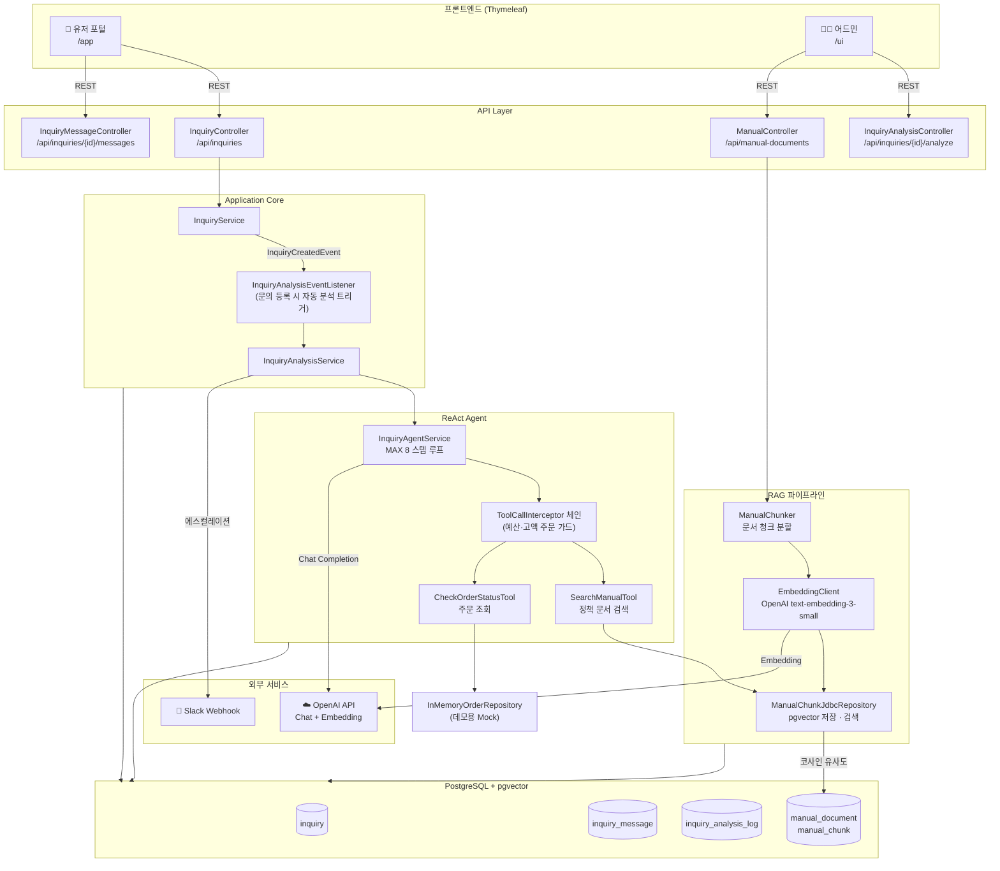
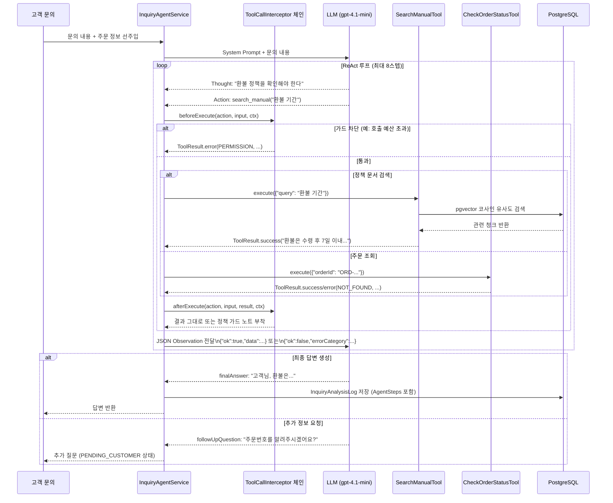
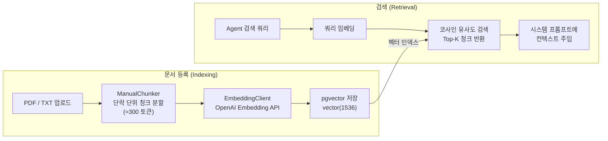
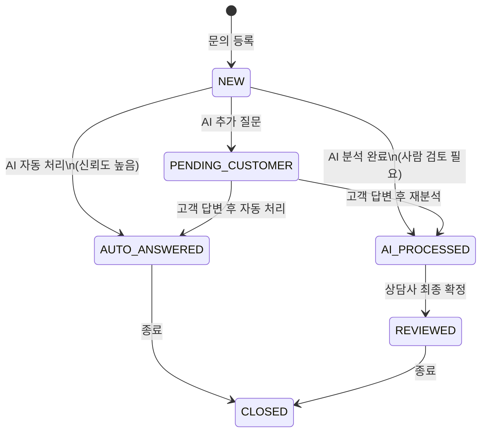

# AI CS Assistant

> AI 기반 고객 문의 자동 분류·답변 시스템 — Spring Boot + ReAct Agent + RAG

LLM 프레임워크(LangChain 등) 없이 **ReAct Agent 루프**와 **RAG 파이프라인**을 직접 설계·구현한 고객 상담 자동화 MVP입니다.

---

## 주요 기능

| 기능 | 설명 |
|---|---|
| **ReAct Agent** | Reasoning + Acting 루프로 툴을 선택·실행하며 다단계 추론 |
| **RAG 기반 답변** | 정책 문서를 청크 분할 → 임베딩 → pgvector 유사도 검색 → 컨텍스트 주입 |
| **멀티턴 대화** | AI 추가 질문 → 고객 답변 → 재분석 반복 흐름 |
| **자동 라우팅** | 고위험·에스컬레이션 문의는 Slack 알림 + 상담사 검토 큐로 분리 |
| **상담사 어드민** | AI 분석 과정(thought/tool/observation) 시각화 + 최종 답변 확정 |
| **대시보드** | 자동응답률·평균 응답시간·카테고리 분포 등 KPI 시각화 |
| **유저 포털** | 주문 기반 문의 등록, 멀티턴 대화, 답변 확인 |

---

## 시스템 아키텍처



---

## ReAct Agent 동작 원리

LLM이 매 스텝마다 **생각(Thought) → 행동(Action) → 관찰(Observation)** 을 반복하며 최종 답변을 도출합니다.



---

## RAG 파이프라인



---

## 문의 상태 머신



---

## 기술 스택

| 분류 | 기술 |
|---|---|
| **Language / Runtime** | Java 17, Spring Boot 3.5 |
| **AI** | OpenAI gpt-4.1-mini (Chat), text-embedding-3-small (Embedding) |
| **Vector DB** | PostgreSQL + pgvector |
| **ORM** | Spring Data JPA + Hibernate |
| **Web / UI** | Spring MVC, Thymeleaf |
| **문서 처리** | Apache PDFBox |
| **코드 품질** | Lombok |
| **테스트** | JUnit 5, Testcontainers, Spring MockMvc |
| **알림** | Slack Incoming Webhook |
| **API 문서** | springdoc-openapi (Swagger UI) |

---

## 핵심 설계 결정

### 1. ReAct Agent 직접 구현
LangChain, Spring AI 등 프레임워크 없이 `InquiryAgentService`에서 루프를 직접 제어합니다. 중간 과정(Thought/Action/Observation)을 `AgentStep` 객체로 수집해 DB에 저장하고, 어드민 UI에서 실시간 시각화합니다.

### 2. 이벤트 기반 분석 트리거
문의 등록 시 `InquiryCreatedEvent`를 발행해 `InquiryAnalysisEventListener`가 비동기로 AI 분석을 트리거합니다. API 응답과 AI 처리를 분리해 등록 응답 속도를 보장합니다.

### 3. 도메인 상태 캡슐화
`Inquiry` 엔티티가 `markAiProcessed()`, `askFollowUp()`, `confirmReview()` 등 상태 전이 메서드를 직접 소유합니다. 외부에서 setter로 상태를 임의 변경할 수 없습니다.

### 4. 주문 정보 선주입 (Context Pre-injection)
문의에 `relatedOrderId`가 있으면 Agent 루프 시작 전 주문 정보를 시스템 메시지에 선주입합니다. 루프 내 툴 호출 횟수를 줄이고 `followUpQuestion` 발생률을 낮춥니다.

### 5. AI 초안과 최종 답변 분리
`AI_PROCESSED` 상태의 AI 초안(`aiDraftAnswer`)은 어드민에게만 표시합니다. 유저는 상담사가 확정한 `finalAnswer`(`REVIEWED`)나 AI 자동 처리(`AUTO_ANSWERED`) 결과만 볼 수 있습니다.

### 6. 멀티턴 추가 질문 최대 3회 제한 및 에스컬레이션
Agent는 필요한 정보(주문번호 등)가 없을 때 `followUpQuestion`으로 고객에게 되물을 수 있습니다. 단, 동일 대화에서 최대 3회까지만 허용하며, 3회 이후에도 유효한 정보를 얻지 못하면 `needsHumanReview: true`로 상담사에게 에스컬레이션합니다. "기억 안나요"처럼 모호한 답변은 정보 제공으로 인정하지 않고 추가 질문을 이어갑니다. 무한 루프 방지와 고객 경험 사이의 균형을 프롬프트 레벨에서 제어합니다.

### 7. UI 선입력으로 Agent 정확도 향상
Agent가 `followUpQuestion`으로 주문번호를 되묻는 대신, 문의 등록 시 카테고리에 따라 주문 선택을 유도합니다. 배송·반품·교환·환불·결제 카테고리 선택 시 주문 목록을 드롭다운으로 제공해 고객이 주문번호를 직접 입력하는 실수를 없애고, Agent 루프 시작 전 정확한 주문 정보를 선주입합니다. **"AI가 얼마나 잘 추론하느냐"도 중요하지만, 입력 품질을 UI 단에서 보장하는 것이 더 근본적인 정확도 향상 방법**임을 설계 과정에서 확인했습니다.

### 8. 에스컬레이션 기반 액션 처리
취소·반품·교환 등 **실제 처리 액션이 필요한 문의**는 AI가 직접 처리하지 않고 `needsHumanReview: true`로 에스컬레이션합니다. 시스템 프롬프트에서 "고객센터에 연락하세요"류 표현을 명시적으로 금지하며, 대신 "담당자가 확인 후 처리해 드리겠습니다"로 안내하고 상담사 검토 큐로 라우팅합니다. 상담사가 실제 처리 후 `finalAnswer`를 작성하면 고객에게 전달됩니다.

### 9. 구조화된 도구 응답 (ToolResult)
도구 실행 결과를 단순 문자열이 아닌 `ToolResult` 레코드로 반환합니다. 실패 시 `ToolErrorCategory`(`TRANSIENT` / `VALIDATION` / `PERMISSION` / `NOT_FOUND`)와 `isRetryable`을 함께 LLM에 JSON으로 전달해, 에이전트가 에러 유형에 맞는 다음 행동(재시도 / 입력 수정 / 에스컬레이션 / 추가 질문)을 선택할 수 있게 합니다. 도구 내부 예외는 `TRANSIENT`로 래핑되어 같은 채널로 전달됩니다.

### 10. 코드 레벨 가드레일 — ToolCallInterceptor
프롬프트 의존만으로는 LLM이 정책을 우회할 위험이 있어, 도구 호출 직전/직후에 끼어드는 `ToolCallInterceptor` 체인을 두었습니다.
- **`ToolCallBudgetInterceptor`** — 한 분석 세션에서 6회 초과 호출을 `PERMISSION` 에러로 차단해 finalAnswer 생성을 강제
- **`HighValueOrderInterceptor`** — `check_order_status` 결과의 결제금액이 100만원 이상이면 정책 가드 노트를 부착해 자동 처리 대신 상담사 라우팅을 강제

새 가드는 `ToolCallInterceptor` 구현체를 Spring 빈으로 추가하면 자동으로 체인에 등록됩니다.

---

## 배포

Railway에 배포되어 있습니다. 별도 설치 없이 바로 체험 가능합니다.

| 화면 | URL |
|---|---|
| 유저 포털 | https://ai-cs-assistant-production.up.railway.app/app |
| 어드민 | https://ai-cs-assistant-production.up.railway.app/ui/inquiries |
| 매뉴얼 관리 | https://ai-cs-assistant-production.up.railway.app/ui/manuals |
| Swagger UI | https://ai-cs-assistant-production.up.railway.app/swagger-ui.html |

---

## 로컬 실행

### 사전 요구사항
- JDK 17+
- PostgreSQL with pgvector extension

```sql
CREATE DATABASE aicsassistant;
\c aicsassistant
CREATE EXTENSION vector;
```

### 환경변수 설정

`application-local.yml` 또는 환경변수로 주입:

```bash
export APP_AI_API_KEY=sk-...          # OpenAI API Key
export APP_AI_MODEL=gpt-4o
export APP_AI_EMBEDDING_MODEL=text-embedding-3-small
export APP_SLACK_WEBHOOK_URL=https://hooks.slack.com/...   # 선택
```

### 실행

```bash
./gradlew bootRun --args='--spring.profiles.active=local'
```

### 접속

| 화면 | URL |
|---|---|
| 유저 포털 | http://localhost:8080/app |
| 어드민 | http://localhost:8080/ui/inquiries |
| 매뉴얼 관리 | http://localhost:8080/ui/manuals |
| Swagger UI | http://localhost:8080/swagger-ui.html |

---

## 데모 시나리오

앱 최초 실행 시 정책 문서 10종을 자동으로 시딩합니다. 문의는 유저 포털에서 직접 등록합니다.

### 추천 테스트 흐름

**1. 주문 관련 자동 처리**
- 유저 포털 → 김민준 로그인 → 문의하기
- 유형: 배송 문의 / 주문: `ORD-20260410-001` 선택
- 내용: "배송이 언제 오나요?"
- → Agent가 `check_order_status` 툴로 주문 조회 후 자동 답변

**2. 정책 문서 RAG**
- 유형: 반품 문의 / 내용: "단순 변심으로 반품하고 싶은데 가능한가요?"
- → `search_manual` 툴로 반품 정책 청크 검색 후 답변 생성

**3. 에스컬레이션 (Slack 알림)**
- 유형: 불만/건의 / 내용: "상담원이 너무 불친절했습니다"
- → AI가 `needsEscalation: true` 판단 → Slack 알림 + 어드민 검토 큐

**4. 메뉴얼 추가 전후 비교**
- `/ui/manuals` → 직접 입력으로 새 정책 등록
- 동일한 문의를 등록 전/후로 비교해 RAG 반영 여부 확인

---

## 프로젝트 구조

```
src/main/java/com/aicsassistant/
├── inquiry/                # 문의 도메인 (Inquiry, InquiryMessage, 상태 머신)
│   ├── domain/
│   ├── application/        # InquiryService, ReviewService
│   ├── api/                # REST Controller
│   ├── dto/
│   └── infra/
├── analysis/               # AI 분석 도메인
│   ├── agent/              # ReAct Agent 루프, AgentTool, ToolResult, ToolCallInterceptor
│   │   ├── interceptor/    # ToolCallBudgetInterceptor, HighValueOrderInterceptor
│   │   └── tool/           # SearchManualTool, CheckOrderStatusTool
│   ├── application/        # InquiryAnalysisService, AnalysisLogService
│   ├── api/
│   ├── domain/             # InquiryAnalysisLog
│   ├── dto/
│   └── infra/              # LlmClient, EmbeddingClient, SlackNotificationService
├── manual/                 # 정책 문서 도메인 (청크 분할, 임베딩, 검색)
│   ├── domain/
│   ├── application/        # ManualService, ManualChunker
│   ├── api/
│   └── infra/              # ManualChunkJdbcRepository (pgvector)
├── order/                  # 주문 조회 (InMemoryOrderRepository — 데모 Mock)
├── user/                   # 더미 유저 스토어 (데모용)
├── ui/                     # Thymeleaf 뷰 컨트롤러
│   ├── application/        # DashboardService (집계 쿼리)
│   ├── controller/
│   └── viewmodel/          # ViewModel, DTO (뷰 전달용)
└── common/                 # 공통 설정, 예외, 부트스트랩 시딩
```
