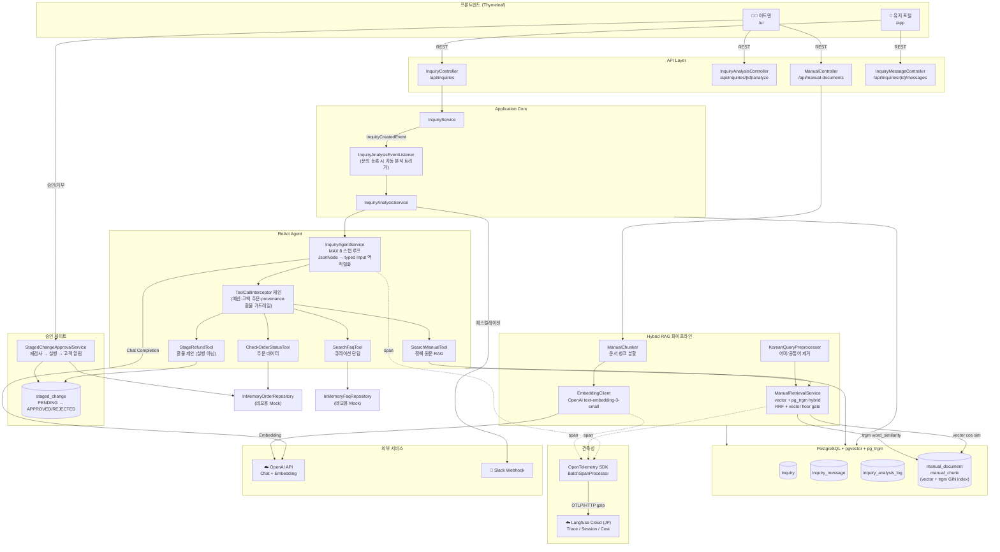
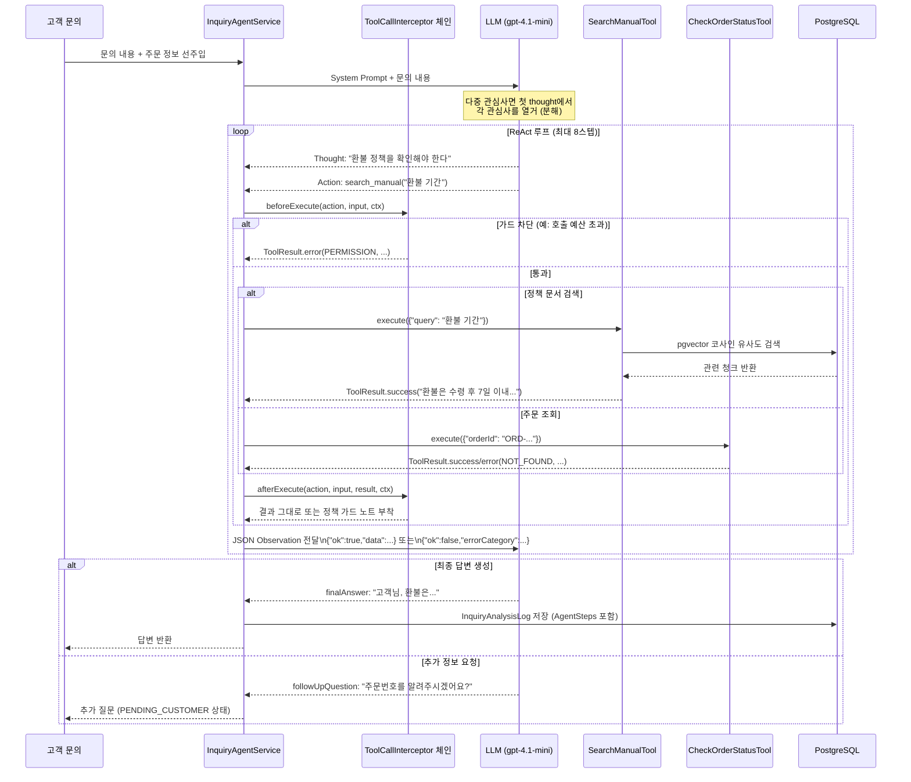
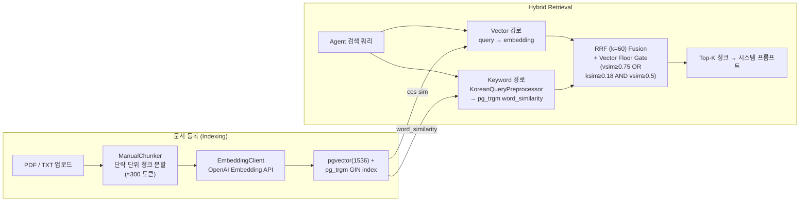
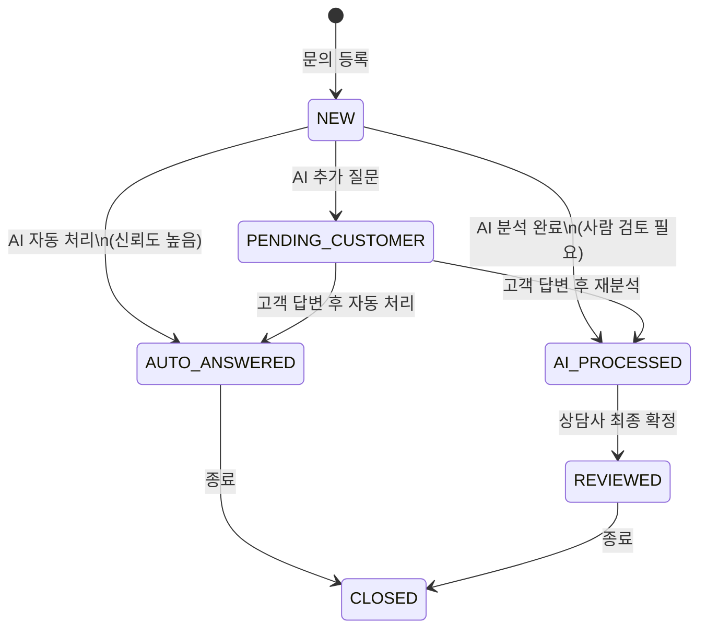

# AI CS Assistant

> AI 기반 고객 문의 자동 분류·답변 시스템 — Spring Boot + ReAct Agent + Hybrid RAG + Langfuse 관측성

🚀 **Live demo**: https://ai-cs-assistant-production.up.railway.app/app
> Railway 무료 플랜(512MB) 기반 데모라 예고 없이 중단될 수 있습니다. 안 열리면 이슈로 알려주세요.
> 데모 계정 3개(김민준 / 이서연 / 박지호) 중 선택 → 문의 등록 → AI agent 분석 → 답변 확인.
> 주문 날짜는 조회 시점 기준으로 계산되므로 언제 보셔도 최근 주문으로 보입니다.

LLM 프레임워크(LangChain 등) 없이 **ReAct Agent 루프**를 직접 구현했습니다.
Agent가 RAG·주문 조회 툴을 선택해 다단계로 추론하고, 환불 같은 **상태 변경은 실행하지 않고 제안만** 해서 상담사 승인을 거칩니다.
검색 품질은 87 케이스 골든셋으로 회귀 테스트하고, 모든 LLM/Agent/RAG 호출은 OpenTelemetry → Langfuse로 관측합니다.


---

## 핵심

| 영역 | 내용 |
|---|---|
| **Agent** | ReAct 루프 직접 구현 — 다단계 툴 사용, 스텝·호출 예산 통제 |
| **RAG** | pgvector + pg_trgm + RRF Hybrid Retrieval |
| **Evaluation** | 87 케이스 골든셋 × Recall@K / MRR / NoMatchAccuracy |
| **Safety** | 툴 정책을 프롬프트가 아니라 코드로 강제 + 쓰기는 상담사 승인 게이트 |
| **Observability** | OTel → Langfuse, token / cost / latency 추적 |

## 검색 품질 (87 케이스 골든셋)

Vector 단독 대비 Hybrid 도입 후 변화:

| 지표 | Vector only | **Hybrid** | 변화 |
|---|---|---|---|
| positive Recall@3 | 0.806 | **0.833** | +2.7pp |
| MRR | 0.806 | **0.833** | +2.7pp |
| hard Recall@3 | 0.000 | **0.143** | **+14.3pp** |
| easy+medium Recall@1 | 1.0 | **1.0** | 유지 |
| NoMatchAccuracy | 1.0 | **1.0** | 유지 |

> hard 케이스가 14% 회복되면서도 negative(검색되면 안 되는) 케이스에서 false positive 0건 유지.
> 데이터셋 구성과 메트릭 정의는 [ADR-0002](docs/adr/0002-hybrid-rag-retrieval.md) 참고.

---

## 시스템 아키텍처


```mermaid
flowchart TB
    subgraph UI["프론트엔드 (Thymeleaf)"]
        direction LR
        UserUI["👤 유저 포털\n/app"]
        AdminUI["🧑‍💼 어드민\n/ui"]
    end

    subgraph API["API Layer"]
        InquiryAPI["InquiryController\n/api/inquiries"]
        AnalysisAPI["InquiryAnalysisController\n/api/inquiries/{id}/analyze"]
        ManualAPI["ManualController\n/api/manual-documents"]
        MessageAPI["InquiryMessageController\n/api/inquiries/{id}/messages"]
    end

    subgraph Core["Application Core"]
        InquiryService["InquiryService"]
        EventListener["InquiryAnalysisEventListener\n(문의 등록 시 자동 분석 트리거)"]
        AnalysisService["InquiryAnalysisService"]
    end

    subgraph Agent["ReAct Agent"]
        AgentLoop["InquiryAgentService\nMAX 8 스텝 루프\nJsonNode → typed Input 역직렬화"]
        Interceptors["ToolCallInterceptor 체인\n(예산·고액 주문·provenance·환불 가드레일)"]
        FaqTool["SearchFaqTool\n큐레이션 단답"]
        SearchTool["SearchManualTool\n정책 원문 RAG"]
        OrderTool["CheckOrderStatusTool\n주문 데이터"]
        RefundTool["StageRefundTool\n환불 제안 (실행 아님)"]
    end

    subgraph Staging["승인 게이트"]
        StagedChange[("staged_change\nPENDING → APPROVED/REJECTED")]
        Approval["StagedChangeApprovalService\n재검사 → 실행 → 고객 알림"]
    end

    subgraph RAG["Hybrid RAG 파이프라인"]
        Chunker["ManualChunker\n문서 청크 분할"]
        EmbedClient["EmbeddingClient\nOpenAI text-embedding-3-small"]
        KoreanPrep["KoreanQueryPreprocessor\n어미/공통어 제거"]
        Retrieval["ManualRetrievalService\nvector + pg_trgm hybrid\nRRF + vector floor gate"]
    end

    subgraph DB["PostgreSQL + pgvector + pg_trgm"]
        T1[("inquiry")]
        T2[("inquiry_message")]
        T3[("inquiry_analysis_log")]
        T4[("manual_document\nmanual_chunk\n(vector + trgm GIN index)")]
    end

    subgraph Observe["관측성"]
        OTel["OpenTelemetry SDK\nBatchSpanProcessor"]
        Langfuse["☁️ Langfuse Cloud (JP)\nTrace / Session / Cost"]
    end

    subgraph External["외부 서비스"]
        OpenAI["☁️ OpenAI API\nChat + Embedding"]
        Slack["💬 Slack Webhook"]
    end

    UserUI -->|REST| InquiryAPI & MessageAPI
    AdminUI -->|REST| AnalysisAPI & ManualAPI
    InquiryAPI --> InquiryService
    InquiryService -->|InquiryCreatedEvent| EventListener
    EventListener --> AnalysisService
    AnalysisService --> AgentLoop
    AgentLoop --> Interceptors --> FaqTool & SearchTool & OrderTool & RefundTool
    RefundTool --> StagedChange
    AdminUI -->|승인/거부| Approval
    Approval --> StagedChange
    Approval --> InMemoryOrder
    FaqTool --> InMemoryFaq["InMemoryFaqRepository\n(데모용 Mock)"]
    SearchTool --> Retrieval
    OrderTool --> InMemoryOrder["InMemoryOrderRepository\n(데모용 Mock)"]
    Retrieval -->|vector cos sim| T4
    Retrieval -->|trgm word_similarity| T4
    KoreanPrep --> Retrieval
    AgentLoop -->|Chat Completion| OpenAI
    ManualAPI --> Chunker --> EmbedClient
    EmbedClient -->|Embedding| OpenAI
    AnalysisService -->|에스컬레이션| Slack
    AgentLoop -.->|span| OTel
    Retrieval -.->|span| OTel
    EmbedClient -.->|span| OTel
    OTel -->|OTLP/HTTP gzip| Langfuse
    Core & Agent & RAG --> DB
```

<details>
<summary><b>ReAct 루프 상세 — Thought → Action → Observation 시퀀스</b></summary>


```mermaid
sequenceDiagram
    participant C as 고객 문의
    participant A as InquiryAgentService
    participant I as ToolCallInterceptor 체인
    participant L as LLM (gpt-4.1-mini)
    participant S as SearchManualTool
    participant O as CheckOrderStatusTool
    participant DB as PostgreSQL

    C->>A: 문의 내용 + 주문 정보 선주입
    A->>L: System Prompt + 문의 내용

    Note over L: 다중 관심사면 첫 thought에서<br/>각 관심사를 열거 (분해)

    loop ReAct 루프 (최대 8스텝)
        L-->>A: Thought: "환불 정책을 확인해야 한다"
        L-->>A: Action: search_manual("환불 기간")

        A->>I: beforeExecute(action, input, ctx)
        alt 가드 차단 (예: 호출 예산 초과)
            I-->>A: ToolResult.error(PERMISSION, ...)
        else 통과
            alt 정책 문서 검색
                A->>S: execute({"query": "환불 기간"})
                S->>DB: pgvector 코사인 유사도 검색
                DB-->>S: 관련 청크 반환
                S-->>A: ToolResult.success("환불은 수령 후 7일 이내...")
            else 주문 조회
                A->>O: execute({"orderId": "ORD-..."})
                O-->>A: ToolResult.success/error(NOT_FOUND, ...)
            end
            A->>I: afterExecute(action, input, result, ctx)
            I-->>A: 결과 그대로 또는 정책 가드 노트 부착
        end

        A->>L: JSON Observation 전달\n{"ok":true,"data":...} 또는\n{"ok":false,"errorCategory":...}
    end

    alt 최종 답변 생성
        L-->>A: finalAnswer: "고객님, 환불은..."
        A->>DB: InquiryAnalysisLog 저장 (AgentSteps 포함)
        A-->>C: 답변 반환
    else 추가 정보 요청
        L-->>A: followUpQuestion: "주문번호를 알려주시겠어요?"
        A-->>C: 추가 질문 (PENDING_CUSTOMER 상태)
    end
```

</details>

<details>
<summary><b>Hybrid RAG 파이프라인 — 색인부터 검색까지</b></summary>

벡터 단독 검색은 paraphrase에 강하지만 **정확한 토큰 매칭(영어 혼용, 오타, 한국어 어미 변형)에 약합니다.** 두 검색의 약점이 정확히 반대라 RRF로 결합하면 둘 다 보완됩니다.


```mermaid
flowchart LR
    subgraph Indexing["문서 등록 (Indexing)"]
        direction TB
        Upload["PDF / TXT 업로드"]
        Chunk["ManualChunker\n단락 단위 청크 분할\n(≈300 토큰)"]
        Embed["EmbeddingClient\nOpenAI Embedding API"]
        Store["pgvector(1536) +\npg_trgm GIN index"]
        Upload --> Chunk --> Embed --> Store
    end

    subgraph Retrieval["Hybrid Retrieval"]
        direction TB
        Query["Agent 검색 쿼리"]
        VPath["Vector 경로\nquery → embedding"]
        KPath["Keyword 경로\nKoreanQueryPreprocessor\n→ pg_trgm word_similarity"]
        Fuse["RRF (k=60) Fusion\n+ Vector Floor Gate\n(vsim≥0.75 OR<br/>ksim≥0.18 AND vsim≥0.5)"]
        Inject["Top-K 청크 → 시스템 프롬프트"]
        Query --> VPath & KPath
        VPath --> Fuse
        KPath --> Fuse
        Fuse --> Inject
    end

    Store -->|cos sim| VPath
    Store -->|word_similarity| KPath
```

`ManualRetrievalService`의 판단:

- **Vector floor gating** — `vector ≥ 0.75 OR (keyword ≥ 0.18 AND vector ≥ 0.5)`. keyword 노이즈로 인한 false positive 차단
- **RRF (k=60)** — rank만 사용해 점수 정규화 불필요
- **Korean preprocessing** — pg_trgm은 한국어 형태소를 모른다. `"수 있나요"`, `"어떻게"` 같은 어미가 모든 문서와 trigram이 겹쳐 점수를 부풀리므로 `KoreanQueryPreprocessor`가 사전 제거
- **Index-friendly SQL** — `WHERE ? <% content` + `<<->` distance로 `gin_trgm_ops` GIN 인덱스 활용 (함수 호출 비교는 인덱스를 못 탄다)
- **Augmented gate** — keyword-only 후보가 vector top-K 밖에 있어도 vector score를 보강해 gate를 통과시킨다

</details>

<details>
<summary><b>골든셋 구성 — 87 케이스는 어떻게 만들었나</b></summary>

`src/test/resources/eval/rag-golden-set.csv`

| 분류 | Easy | Medium | Hard | 합 |
|---|---|---|---|---|
| Positive (REFUND/DELIVERY/EXCHANGE/RETURN/MEMBERSHIP/PAYMENT) | 28 | 30 | 14 | 72 |
| Negative (날씨/주식/매장위치/사업자등록 등) | 5 | 5 | 5 | 15 |

- 다양성 축: paraphrase, 영어 혼용(`"refund 가능한가요"`), 오타(`"배달 너무 늦엇어요"`), 매우 짧음(`"반품"`), 구어체
- Negative 3단계: 완전 무관(날씨/점심) / 인접 도메인(매장 영업시간) / 정책 도메인 인접(사업자등록/세금)
- `FakeEmbeddingClient`를 difficulty 기반으로 설계(easy=1.0 / medium=0.91 / hard=0.65) — 검색 로직 개선이 메트릭 차이로 드러나도록
- distractor 25개 회귀 테스트로 vector floor gate가 대규모 데이터에서도 동작함을 검증

메트릭(`RagRetrievalMetrics`): **Recall@K**(놓치지 않는 능력) · **MRR**(정답의 평균 순위) · **NoMatchAccuracy**(헛검색 방지)

</details>

<details>
<summary><b>관측성 상세 — Langfuse span 계층</b></summary>

Langfuse Java SDK가 없어 **OpenTelemetry 표준**으로 OTLP endpoint에 export합니다 (벤더 lock-in 없음).


```
inquiry-analysis-agent (SPAN, root)
  └─ agent-step (SPAN, index=0..N)
     ├─ openai.chat.completion (GENERATION, tokens/cost 자동 집계)
     ├─ openai.embedding (GENERATION)
     └─ rag.retrieve (SPAN, retrieval.path 표시)
```

| Trace 위치 | Type | 자동 집계 |
|---|---|---|
| `inquiry-analysis-agent` (root) | SPAN | `langfuse.session.id`/`user.id`/`trace.tags` |
| `agent-step` | SPAN | `agent.step.index`, `agent.tool` |
| `openai.chat.completion` | **GENERATION** | model, prompt/completion tokens, cost |
| `openai.embedding` | **GENERATION** | model, total tokens, cost |
| `rag.retrieve` | SPAN | `retrieval.path` (hybrid/fallback), `result_count` |

- 표준 GenAI semantic convention을 구/신 OTel semconv 양쪽에 설정해 비용 계산 호환성 확보
- LLM 호출만 `langfuse.observation.type = "generation"`으로 마킹 → Langfuse의 LLM 전용 UI 활성화
- `langfuse.session.id = "inquiry-{id}"`, `user.id`, `trace.tags = [category:X, urgency:Y]` 로 Sessions/Users/Tags 1급 필터 활용
- 운영 안전 장치: 키 없으면 `OpenTelemetry.noop()` fallback, `destroyMethod = "close"`로 종료 시 flush, `SpanLimits.maxAttributeValueLength = 8192` truncate, gzip + tuned BatchSpanProcessor

</details>

---

## 핵심 설계 판단 3개

### ① LLM 프레임워크 없이 ReAct 루프를 직접 구현했다

스텝 상한·툴 호출 예산·인터셉터 훅·관측 span을 직접 통제하기 위해서입니다. 대신 streaming과 provider 어댑터를 직접 만들어야 하는 대가를 집니다.

→ [ADR-0001](docs/adr/0001-react-loop-without-framework.md)

### ② RAG를 감이 아니라 평가로 개선했다

Vector 단독 → 골든셋에서 hard 케이스 14개가 **전부** threshold에 컷되는 것을 확인 → pg_trgm keyword 검색 추가 → hard Recall@3 `0.0 → 0.143`을 수치로 검증. "RAG를 했다"가 아니라 "회귀를 측정하며 고쳤다"는 흐름입니다.

→ [ADR-0002](docs/adr/0002-hybrid-rag-retrieval.md)

### ③ Agent의 쓰기는 실행이 아니라 제안이다

```
Agent → stage_refund (제안 접수)
      → 상담사 승인 표면
      → 승인 시점 재검사
      → 실행
```

에이전트는 환불을 **실행할 수단 자체가 없습니다.** 가드레일(provenance·주문상태·금액·중복)은 프롬프트 지시가 아니라 `ToolCallInterceptor`가 코드로 검사하고, 승인 시점에 같은 기준으로 다시 검사합니다.

→ [ADR-0007](docs/adr/0007-writes-stage-only.md) · [ADR-0003](docs/adr/0003-tool-policy-in-interceptors.md) · [ADR-0008](docs/adr/0008-counselor-owns-refund-amount.md)

---

## Deep Dive

| 문서 | 내용 |
|---|---|
| [Production Lessons](docs/operations.md) | OOM 크래시 루프, 트랜잭션 안 LLM 호출, 분석 유실 복구, 프롬프트 캐시 |
| [ADR 전체](docs/adr/README.md) | 되돌리기 어려운 결정 9건과 그 근거·대가 |

**ADR** — 결정의 *결론*은 아래, *왜 그렇게 정했고 무엇을 대가로 냈는지*는 각 문서에 있습니다.

| # | 결정 |
|---|---|
| [0001](docs/adr/0001-react-loop-without-framework.md) | LLM 프레임워크 없이 ReAct 루프를 직접 구현한다 |
| [0002](docs/adr/0002-hybrid-rag-retrieval.md) | 정책 검색은 vector 단독이 아니라 Hybrid 로 한다 |
| [0003](docs/adr/0003-tool-policy-in-interceptors.md) | 툴 정책은 프롬프트가 아니라 인터셉터에서 코드로 강제한다 |
| [0004](docs/adr/0004-fence-untrusted-customer-text.md) | 고객이 쓴 텍스트를 울타리로 분리한다 |
| [0005](docs/adr/0005-owner-scoped-order-lookup.md) | 주문 조회는 소유자 스코프로만 하고, 타인 주문은 NOT_FOUND 로 응답한다 |
| [0006](docs/adr/0006-never-lose-an-inquiry.md) | 에이전트가 실패해도 문의를 유실하지 않는다 |
| [0007](docs/adr/0007-writes-stage-only.md) | 에이전트의 쓰기 툴은 staging 만 하고, 실행은 승인 표면에서만 일어난다 |
| [0008](docs/adr/0008-counselor-owns-refund-amount.md) | 환불 금액의 최종 결정권은 상담사에게 있다 |
| [0009](docs/adr/0009-no-external-calls-in-transactions.md) | 트랜잭션 안에서 외부 호출을 하지 않는다 |

<details>
<summary><b>ADR로 남기지 않은 나머지 설계 판단</b></summary>

- **이벤트 기반 분석 트리거** — 문의 등록 시 `InquiryCreatedEvent`를 발행해 비동기로 분석. API 응답과 AI 처리를 분리
- **도메인 상태 캡슐화** — `Inquiry`가 `markAiProcessed()`, `askFollowUp()` 등 전이 메서드를 소유. 외부 setter로 상태를 바꿀 수 없다
- **되묻기는 3회까지** — 정보가 없으면 `followUpQuestion`으로 되묻되 한 대화에서 3회가 상한이다. 그 뒤에도 못 얻으면 상담사에게 넘긴다. `"기억 안나요"` 같은 모호한 답은 정보 제공으로 치지 않는다 — 무한 루프와 고객 경험 사이의 선
- **행동이 필요한 건은 사람에게** — 취소·반품·교환처럼 실제 처리가 필요한 문의는 AI가 처리하지 않고 에스컬레이션한다. 프롬프트가 `"고객센터에 연락하세요"`류 표현을 명시적으로 금지한다 — **이 시스템이 곧 고객센터**이므로 다른 곳으로 미루는 답변은 그 자체로 실패다
- **구조화된 툴 응답** — `ToolResult`가 `errorCategory`(TRANSIENT/VALIDATION/PERMISSION/NOT_FOUND)와 `isRetryable`을 함께 실어, 모델이 실패 유형에 맞는 다음 행동(재시도 / 입력 수정 / 되묻기 / 에스컬레이션)을 고를 수 있게 한다
- **주문 정보 선주입** — `relatedOrderId`가 있으면 루프 시작 전 주문 정보를 주입해 툴 호출과 되묻기를 줄인다
- **AI 초안과 최종 답변 분리** — `aiDraftAnswer`는 어드민에게만. 유저는 상담사가 확정한 `finalAnswer`나 자동 처리 결과만 본다
- **UI 선입력으로 정확도 향상** — 카테고리에 따라 주문 드롭다운을 노출해 고객이 주문번호를 오타낼 여지를 없앤다. *AI가 얼마나 잘 추론하느냐보다 입력 품질을 UI에서 보장하는 쪽이 더 근본적이었다*
- **타입 세이프 툴 인터페이스** — `AgentTool<I>`의 입력 record가 JSON Schema의 유일한 출처다. `ToolSchemaGenerator`가 `@ToolParam`을 읽어 생성하므로 record와 스키마가 어긋날 수 없고, 생성자에 묶인 `customerIdentifier`·`inquiryId`는 모델이 인자로 표현할 수단 자체가 없다
- **유사 기능 툴 차별화** — `search_faq`(큐레이션 단답)와 `search_manual`(정책 원문 RAG)을 의도적으로 겹치게 두고 `usageBoundary`로 경계를 그어, 모델이 설명만으로 올바른 툴을 고르는지 검증한다
- **다중 관심사 분해** — 한 메시지의 여러 요청을 첫 `thought`에서 열거하고, 관심사별 헤더가 붙은 하나의 통합 답변을 만든다
- **분리 가능한 모놀리스** — `analysis` 패키지가 단방향 의존 + 이벤트 격리 + 외부 의존성 격리 상태라, 리스너를 REST/큐로 바꾸면 그대로 분리된다. 분리 트리거는 AI latency가 일반 API p99에 영향을 주거나, LLM 스택을 Python 생태계로 옮길 가치가 생길 때

</details>

---

## 화면

**상담사 어드민 — AI 분석 과정 시각화**
단계별 thought/action/observation을 그대로 노출합니다. 툴 응답은 `ToolResult` 구조라 `errorCategory`/`isRetryable`까지 보입니다.


**Langfuse — LLM 호출 상세**
GENERATION span을 열면 prompt/response/token/비용/모델이 펼쳐집니다.


**유저 포털 — 주문 선택으로 입력 품질 보장**


<details>
<summary><b>문의 상태 머신</b></summary>


```mermaid
stateDiagram-v2
    [*] --> NEW : 문의 등록

    NEW --> AI_PROCESSED : AI 분석 완료\n(사람 검토 필요)
    NEW --> AUTO_ANSWERED : AI 자동 처리\n(신뢰도 높음)
    NEW --> PENDING_CUSTOMER : AI 추가 질문

    PENDING_CUSTOMER --> AI_PROCESSED : 고객 답변 후 재분석
    PENDING_CUSTOMER --> AUTO_ANSWERED : 고객 답변 후 자동 처리

    AI_PROCESSED --> REVIEWED : 상담사 최종 확정

    AUTO_ANSWERED --> CLOSED : 종료
    REVIEWED --> CLOSED : 종료
```

</details>

---

## 기술 스택

| 분류 | 기술 |
|---|---|
| **Language / Runtime** | Java 17, Spring Boot 3.5 |
| **AI** | OpenAI gpt-4.1-mini (Chat), text-embedding-3-small (Embedding) |
| **Hybrid Search** | PostgreSQL + pgvector (vector) + pg_trgm (keyword) + RRF fusion |
| **관측성** | OpenTelemetry SDK 1.46 → Langfuse Cloud (OTLP/HTTP gzip) |
| **ORM** | Spring Data JPA + Hibernate |
| **Web / UI** | Spring MVC, Thymeleaf |
| **문서 처리** | Apache PDFBox |
| **테스트** | JUnit 5, Testcontainers (pgvector image), Spring MockMvc, AssertJ |
| **알림** | Slack Incoming Webhook |
| **API 문서** | springdoc-openapi (Swagger UI) |

---

## 로컬 실행

**사전 요구사항** — JDK 17+, Docker

```bash
docker compose up -d     # pgvector/pgvector:pg16, schema.sql 자동 실행
```

`.env.local`:

```bash
# 필수
OPENAI_API_KEY=sk-...

# 선택 — Langfuse 관측성 (없으면 trace export 비활성화)
LANGFUSE_PUBLIC_KEY=pk-lf-...
LANGFUSE_SECRET_KEY=sk-lf-...
LANGFUSE_BASE_URL=https://jp.cloud.langfuse.com    # JP/US/EU 중 본인 region

# 선택 — Slack 에스컬레이션 알림
SLACK_WEBHOOK_URL=https://hooks.slack.com/...
```

```bash
./gradlew bootRun --args='--spring.profiles.active=local'
```

IntelliJ 사용 시 EnvFile 플러그인 + Run Configuration에서 `.env.local` 활성화 (Active profiles: `local`).

| 화면 | 로컬 | Live |
|---|---|---|
| 유저 포털 | http://localhost:8080/app | [열기](https://ai-cs-assistant-production.up.railway.app/app) |
| 어드민 | http://localhost:8080/ui/inquiries | [열기](https://ai-cs-assistant-production.up.railway.app/ui/inquiries) |
| 대시보드 | http://localhost:8080/ui/dashboard | [열기](https://ai-cs-assistant-production.up.railway.app/ui/dashboard) |
| 매뉴얼 관리 | http://localhost:8080/ui/manuals | [열기](https://ai-cs-assistant-production.up.railway.app/ui/manuals) |
| Swagger UI | http://localhost:8080/swagger-ui.html | [열기](https://ai-cs-assistant-production.up.railway.app/swagger-ui.html) |

---

## 데모 시나리오

앱 최초 실행 시 정책 문서 10종을 자동 시딩합니다. 문의는 유저 포털에서 등록합니다.

| # | 시나리오 | 입력 | 확인할 것 |
|---|---|---|---|
| 1 | 주문 자동 처리 | 배송 문의 / `ORD-20260410-001` / "배송이 언제 오나요?" | `check_order_status` 호출 후 자동 답변 |
| 2 | 정책 RAG | 반품 문의 / "단순 변심으로 반품하고 싶은데 가능한가요?" | `search_manual`이 반품 정책 청크 검색 |
| 3 | 에스컬레이션 | 불만/건의 / "상담원이 너무 불친절했습니다" | `needsEscalation: true` → Slack 알림 + 검토 큐 |
| 4 | 매뉴얼 반영 | `/ui/manuals`에서 새 정책 등록 후 같은 문의 재등록 | 등록 전/후 답변 차이 |
| 5 | 다중 관심사 | 배송 문의 / "배송 언제 와요? 그리고 반품 가능 기간도 알려주세요" | 툴 2개 호출 → `1) 배송: … 2) 반품: …` 통합 답변 |
| 6 | 승인 게이트 | 환불 요청 문의 | Agent가 제안만 접수 → 어드민에서 승인해야 실행 |

---

## 프로젝트 구조

```
src/main/java/com/aicsassistant/
├── inquiry/                # 문의 도메인 (Inquiry, InquiryMessage, 상태 머신)
├── analysis/               # AI 분석 도메인
│   ├── agent/              # ReAct 루프, AgentTool, ToolSchemaGenerator, ToolResult
│   │   ├── interceptor/    # 예산·고액주문·provenance·환불 가드레일
│   │   └── tool/           # SearchFaq, SearchManual, CheckOrderStatus, StageRefund
│   ├── application/        # InquiryAnalysisService, PromptFactory
│   ├── domain/             # InquiryAnalysisLog
│   └── infra/              # llm/(OpenAiClient) · vector/(RAG 검색)
├── manual/                 # 정책 문서 (청크 분할, 임베딩, 검색)
├── staging/                # 환불 승인 게이트 (StagedChange, RefundGuardrails)
├── faq/ · order/ · user/   # 데모용 InMemory Mock
├── ui/                     # Thymeleaf 뷰 컨트롤러 + DashboardService
└── common/                 # 공통 설정, 예외, 부트스트랩 시딩
```
