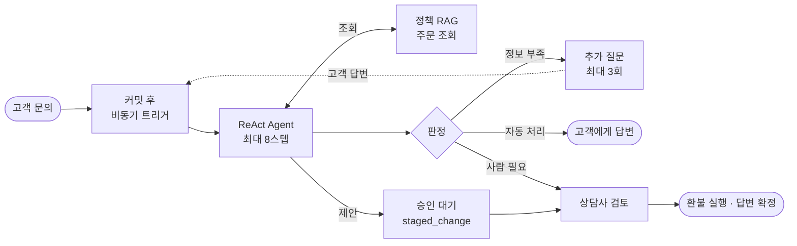
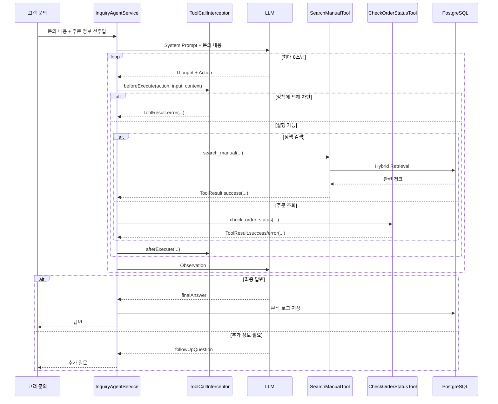
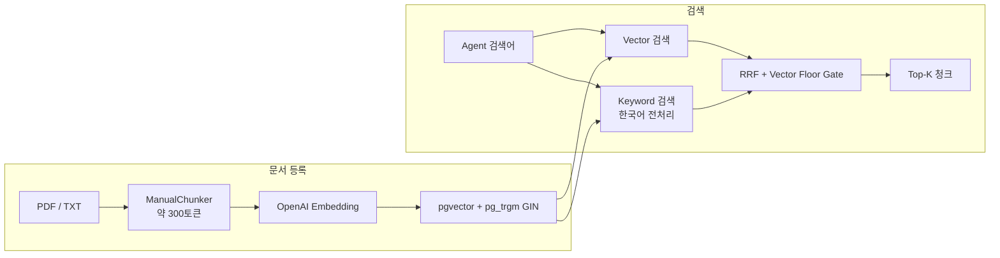
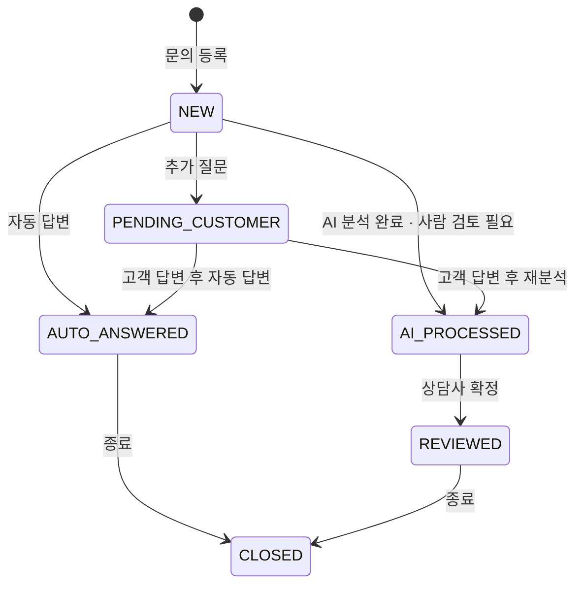

# AI CS Assistant

> Spring Boot 기반 고객 문의 자동 분류·답변 시스템  
> ReAct Agent + Hybrid RAG + Langfuse

**Live demo**: https://ai-cs-assistant-production.up.railway.app/app

> Railway 무료 플랜(512MB)에서 동작하는 데모라 예고 없이 중단될 수 있습니다.  
> 김민준 / 이서연 / 박지호 중 한 계정을 선택한 뒤 문의를 등록하면 Agent 분석 과정을 확인할 수 있습니다.  
> 주문 날짜는 조회 시점을 기준으로 계산합니다.

LangChain 같은 LLM 프레임워크를 사용하지 않고 ReAct Agent 루프를 직접 구현했습니다.  
Agent는 문의 내용에 따라 정책 검색, 주문 조회 등의 툴을 선택합니다. 환불처럼 실제 상태 변경이 필요한 작업은 바로 실행하지 않고 제안만 만든 뒤 상담사 승인을 거칩니다.

RAG 검색은 87개 골든셋으로 회귀 테스트하고, LLM / Agent / RAG 호출은 OpenTelemetry를 통해 Langfuse에서 추적합니다.

**상담사 화면에서는 Agent가 어떤 툴을 어떤 순서로 사용했는지 확인할 수 있습니다.**


---

## 핵심 기능

| 영역 | 내용 |
|---|---|
| **Agent** | ReAct 루프 직접 구현, 다단계 Tool Use, 최대 스텝 및 호출 예산 제한 |
| **RAG** | pgvector + pg_trgm + RRF 기반 Hybrid Retrieval |
| **Evaluation** | 87개 골든셋, Recall@K / MRR / NoMatchAccuracy |
| **Safety** | 툴 정책을 코드에서 검사하고, 상태 변경은 상담사 승인 후 실행 |
| **Observability** | OpenTelemetry → Langfuse, token / cost / latency 추적 |

## 검색 품질

Vector 검색만 사용했을 때와 Hybrid 검색을 적용한 뒤의 결과입니다.

| 지표 | Vector only | **Hybrid** | 변화 |
|---|---:|---:|---:|
| positive Recall@3 | 0.806 | **0.833** | +2.7pp |
| MRR | 0.806 | **0.833** | +2.7pp |
| hard Recall@3 | 0.000 | **0.143** | **+14.3pp** |
| easy+medium Recall@1 | 1.000 | **1.000** | 유지 |
| NoMatchAccuracy | 1.000 | **1.000** | 유지 |

표현 차이가 큰 hard 케이스 일부를 추가로 찾으면서도 negative 케이스의 false positive는 늘어나지 않았습니다.

데이터셋 구성과 검색 방식 변경 이유는 [ADR-0002](docs/adr/0002-hybrid-rag-retrieval.md)에 정리했습니다.

---

## 시스템 아키텍처

문의 등록부터 답변 또는 상담사 처리까지의 흐름입니다.


```mermaid
flowchart LR
    Q(["고객 문의"]) --> EV["커밋 후<br/>비동기 트리거"]
    EV --> AG["ReAct Agent<br/>최대 8스텝"]

    AG <-->|조회| TOOLS["정책 RAG<br/>주문 조회"]
    AG -->|제안| GATE["승인 대기<br/>staged_change"]

    AG --> D{"판정"}
    D -->|정보 부족| FU["추가 질문<br/>최대 3회"]
    FU -.->|고객 답변| EV
    D -->|자동 처리| ANS(["고객에게 답변"])
    D -->|사람 필요| CS["상담사 검토"]

    GATE --> CS
    CS --> EXEC(["환불 실행 · 답변 확정"])
```

구조에서 신경 쓴 부분은 다음 세 가지입니다.

- Agent는 환불을 직접 실행하지 않습니다. `staged_change`에 제안을 저장하고 실제 실행은 상담사 승인 경로에서만 일어납니다. ([ADR-0007](docs/adr/0007-writes-stage-only.md))
- Agent 실행이 실패하더라도 문의가 그대로 방치되지 않도록 했습니다. 최대 스텝 소진, 응답 형식 오류, 재시도 소진 시 상담사 검토로 넘깁니다. ([ADR-0006](docs/adr/0006-never-lose-an-inquiry.md))
- LLM 호출 중에는 DB 트랜잭션을 유지하지 않습니다. 읽기 / Agent 실행 / 결과 저장을 분리했습니다. ([ADR-0009](docs/adr/0009-no-external-calls-in-transactions.md))

| 계층 | 역할 | 주요 클래스 |
|---|---|---|
| 진입 | REST API · Thymeleaf 뷰 | `InquiryController` · `CounselorViewController` |
| 유스케이스 | 처리 순서와 트랜잭션 경계 | `InquiryAnalysisService` · `InquiryAnalysisRecorder` |
| Agent | ReAct 루프 | `InquiryAgentService` · `ToolInvoker` · `AgentResponseParser` · `AgentTrace` |
| 정책 | 툴 호출 전후 정책 검사 | `ToolCallInterceptor` 4종 |
| 검색 | Hybrid RAG | `ManualRetrievalService` · `ManualChunkRetrievalRepository` |
| 승인 | 상태 변경 실행 경로 | `StagedChangeApprovalService` |
| 저장소 | 문의 · 분석 로그 · 매뉴얼 · 승인 데이터 | PostgreSQL + pgvector + pg_trgm |
| 외부 | LLM · Slack · 관측 | `OpenAiClient` · `SlackCounselorNotificationService` · OTLP → Langfuse |

세부 동작은 아래에서 펼쳐볼 수 있습니다.

<details>
<summary><b>ReAct 루프 상세</b></summary>


```mermaid
sequenceDiagram
    participant C as 고객 문의
    participant A as InquiryAgentService
    participant I as ToolCallInterceptor
    participant L as LLM
    participant S as SearchManualTool
    participant O as CheckOrderStatusTool
    participant DB as PostgreSQL

    C->>A: 문의 내용 + 주문 정보 선주입
    A->>L: System Prompt + 문의 내용

    loop 최대 8스텝
        L-->>A: Thought + Action
        A->>I: beforeExecute(action, input, context)

        alt 정책에 의해 차단
            I-->>A: ToolResult.error(...)
        else 실행 가능
            alt 정책 검색
                A->>S: search_manual(...)
                S->>DB: Hybrid Retrieval
                DB-->>S: 관련 청크
                S-->>A: ToolResult.success(...)
            else 주문 조회
                A->>O: check_order_status(...)
                O-->>A: ToolResult.success/error(...)
            end
            A->>I: afterExecute(...)
        end

        A->>L: Observation
    end

    alt 최종 답변
        L-->>A: finalAnswer
        A->>DB: 분석 로그 저장
        A-->>C: 답변
    else 추가 정보 필요
        L-->>A: followUpQuestion
        A-->>C: 추가 질문
    end
```

Agent는 매 스텝마다 다음 셋 중 하나를 선택합니다.

1. 툴 호출
2. 고객에게 추가 질문
3. 최종 답변

최대 8스텝을 넘기면 툴 사용을 막고 지금까지 수집한 정보로 상담사 브리핑을 만들도록 합니다. 그마저 실패하면 코드에서 최소 브리핑을 생성합니다.

</details>

<details>
<summary><b>Hybrid RAG 파이프라인</b></summary>

Vector 검색은 의미가 비슷한 표현을 찾는 데 유리하지만, 영어가 섞이거나 오타가 있거나 특정 단어를 정확히 찾아야 하는 질의에서는 놓치는 경우가 있었습니다.

이를 보완하기 위해 vector 검색과 `pg_trgm` 기반 keyword 검색을 함께 사용하고 RRF로 순위를 합칩니다.


```mermaid
flowchart LR
    subgraph Indexing["문서 등록"]
        direction TB
        Upload["PDF / TXT"]
        Chunk["ManualChunker<br/>약 300토큰"]
        Embed["OpenAI Embedding"]
        Store["pgvector + pg_trgm GIN"]
        Upload --> Chunk --> Embed --> Store
    end

    subgraph Retrieval["검색"]
        direction TB
        Query["Agent 검색어"]
        VPath["Vector 검색"]
        KPath["Keyword 검색<br/>한국어 전처리"]
        Fuse["RRF + Vector Floor Gate"]
        Result["Top-K 청크"]
        Query --> VPath & KPath
        VPath --> Fuse
        KPath --> Fuse
        Fuse --> Result
    end

    Store --> VPath
    Store --> KPath
```

`ManualRetrievalService`에서 적용한 주요 규칙입니다.

- **Vector floor gating**  
  `vector >= 0.75 OR (keyword >= 0.18 AND vector >= 0.5)`  
  keyword 점수만 높고 의미적으로는 관련 없는 결과가 올라오는 것을 줄이기 위해 사용했습니다.

- **RRF (k=60)**  
  Vector와 keyword의 점수 범위가 다르기 때문에 raw score를 합치지 않고 rank 기준으로 결합합니다.

- **Korean preprocessing**  
  `"수 있나요"`, `"어떻게"`처럼 검색에 크게 도움이 되지 않는 표현을 keyword 검색 전에 제거합니다.

- **Index-friendly SQL**  
  `gin_trgm_ops` 인덱스를 사용할 수 있도록 연산자 기반 조건과 정렬을 사용합니다.

- **Augmented gate**  
  Keyword 검색으로만 잡힌 후보도 vector score를 다시 확인해 최종 gate를 적용합니다.

</details>

<details>
<summary><b>골든셋 구성</b></summary>

`src/test/resources/eval/rag-golden-set.csv`

| 분류 | Easy | Medium | Hard | 합 |
|---|---:|---:|---:|---:|
| Positive | 28 | 30 | 14 | 72 |
| Negative | 5 | 5 | 5 | 15 |

Positive 케이스에는 다음과 같은 변형을 넣었습니다.

- paraphrase
- 영어 혼용 (`"refund 가능한가요"`)
- 오타 (`"배달 너무 늦엇어요"`)
- 짧은 질의 (`"반품"`)
- 구어체

Negative 케이스는 완전히 무관한 질문뿐 아니라 정책 문서와 단어가 일부 겹칠 수 있는 질문도 포함했습니다.

평가 지표는 다음 세 가지입니다.

- **Recall@K**: 정답 문서가 상위 K개 안에 포함되는지
- **MRR**: 정답 문서가 얼마나 앞 순위에 나오는지
- **NoMatchAccuracy**: 검색하지 않아야 할 질문에서 결과를 비워두는지

</details>

<details>
<summary><b>관측성</b></summary>

LLM 호출만 별도로 보는 대신 문의 한 건을 하나의 trace로 묶었습니다.


```text
inquiry-analysis-agent
  └─ agent-step
     ├─ openai.chat.completion
     ├─ openai.embedding
     └─ rag.retrieve
```

| Trace 위치 | Type | 기록 |
|---|---|---|
| `inquiry-analysis-agent` | SPAN | session / user / category / urgency |
| `agent-step` | SPAN | step index / tool |
| `openai.chat.completion` | GENERATION | model / prompt tokens / completion tokens / cost |
| `openai.embedding` | GENERATION | model / token / cost |
| `rag.retrieve` | SPAN | 검색 방식 / 결과 수 |

Java 전용 Langfuse SDK 대신 OpenTelemetry를 사용해 OTLP endpoint로 전송합니다.


운영 시에는 다음도 같이 처리합니다.

- Langfuse 키가 없으면 noop tracer 사용
- 애플리케이션 종료 시 `BatchSpanProcessor` flush
- 긴 attribute 값 제한
- gzip 전송
- prompt / response / token / cost 추적


</details>

---

## 주요 설계 결정

### 1. ReAct 루프를 직접 구현

Agent 루프의 최대 스텝, 툴 호출 예산, 정책 인터셉터, trace 위치를 직접 제어하고 싶어서 LangChain 같은 프레임워크를 사용하지 않았습니다.

대신 streaming, provider adapter 등 프레임워크가 제공하는 기능이 필요해지면 직접 구현해야 합니다.

→ [ADR-0001](docs/adr/0001-react-loop-without-framework.md)

### 2. RAG 변경은 골든셋으로 확인

처음에는 pgvector만 사용했습니다. 골든셋을 만든 뒤 표현 차이가 큰 hard 케이스가 threshold에서 전부 탈락하는 것을 확인했고, `pg_trgm` 검색과 RRF를 추가했습니다.

변경 후 hard Recall@3은 `0.000 → 0.143`, 전체 MRR은 `0.806 → 0.833`으로 올라갔고 NoMatchAccuracy는 1.0을 유지했습니다.

→ [ADR-0002](docs/adr/0002-hybrid-rag-retrieval.md)

### 3. Agent의 상태 변경은 승인 후 실행

환불 같은 작업은 Agent가 바로 실행하지 않습니다.

```text
Agent
  ↓
stage_refund
  ↓
staged_change(PENDING)
  ↓
상담사 승인
  ↓
승인 시점 정책 재검사
  ↓
실행
```

제안 시점과 승인 시점에 주문 소유권, 상태, 금액, 중복 여부를 검사합니다.

→ [ADR-0007](docs/adr/0007-writes-stage-only.md)  
→ [ADR-0003](docs/adr/0003-tool-policy-in-interceptors.md)  
→ [ADR-0008](docs/adr/0008-counselor-owns-refund-amount.md)

---

## Deep Dive

README에는 전체 흐름과 주요 판단만 남기고, 운영 중 겪은 문제와 상세 결정은 별도 문서에 정리했습니다.

| 문서 | 내용 |
|---|---|
| [Production Lessons](docs/operations.md) | OOM, LLM 호출과 트랜잭션 경계, 분석 유실 복구, Prompt Cache |
| [ADR](docs/adr/README.md) | 주요 설계 결정과 trade-off |

### ADR

| # | 결정 |
|---|---|
| [0001](docs/adr/0001-react-loop-without-framework.md) | ReAct 루프를 프레임워크 없이 직접 구현 |
| [0002](docs/adr/0002-hybrid-rag-retrieval.md) | Vector 단독 검색에서 Hybrid 검색으로 변경 |
| [0003](docs/adr/0003-tool-policy-in-interceptors.md) | Tool 정책을 프롬프트가 아니라 코드에서 검사 |
| [0004](docs/adr/0004-fence-untrusted-customer-text.md) | 고객 입력과 신뢰 가능한 컨텍스트를 분리 |
| [0005](docs/adr/0005-owner-scoped-order-lookup.md) | 주문 조회 범위를 사용자 소유 주문으로 제한 |
| [0006](docs/adr/0006-never-lose-an-inquiry.md) | Agent 실패 시에도 문의가 유실되지 않도록 처리 |
| [0007](docs/adr/0007-writes-stage-only.md) | 쓰기 Tool은 제안만 만들고 실행은 승인 경로로 제한 |
| [0008](docs/adr/0008-counselor-owns-refund-amount.md) | 환불 금액의 최종 결정은 상담사가 수행 |
| [0009](docs/adr/0009-no-external-calls-in-transactions.md) | 외부 호출을 DB 트랜잭션 밖으로 분리 |

<details>
<summary><b>그 외 설계 판단</b></summary>

- **이벤트 기반 분석 트리거**  
  문의 등록 트랜잭션이 커밋된 뒤 비동기로 Agent 분석을 시작합니다.

- **도메인 상태 캡슐화**  
  `Inquiry`가 상태 전이 메서드를 갖고 외부에서 상태를 임의로 바꾸지 못하게 했습니다.

- **추가 질문은 최대 3회**  
  필요한 정보가 없으면 고객에게 되묻되, 계속 답을 얻지 못하면 상담사 검토로 넘깁니다.

- **실제 처리가 필요한 문의는 사람에게 전달**  
  취소, 반품, 교환 등 바로 상태를 바꾸는 작업은 Agent 자동 처리 대상에서 제외했습니다.

- **구조화된 ToolResult**  
  `TRANSIENT`, `VALIDATION`, `PERMISSION`, `NOT_FOUND`와 `isRetryable`을 LLM에 같이 전달합니다.

- **주문 정보 선주입**  
  문의에 주문 ID가 있으면 Agent 루프 전에 서버에서 검증된 주문 정보를 함께 넣습니다.

- **AI 초안과 최종 답변 분리**  
  AI가 만든 초안은 상담사 화면에서만 보이고, 고객에게는 확정된 답변만 노출합니다.

- **주문 선택 UI**  
  주문번호를 자유 입력으로 받지 않고 사용자가 자신의 주문 목록에서 고르게 했습니다.

- **타입 기반 Tool Schema 생성**  
  `AgentTool<I>`의 input record를 기준으로 JSON Schema를 생성해 Java 타입과 Tool Schema가 따로 관리되지 않게 했습니다.

- **큐레이션 FAQ Tool 제거**  
  정책 원문 RAG와 별도로 키워드 매칭 FAQ Tool을 두었다가, 골든셋으로 재보니 응답 25건 중 3분의 1만 맞아서 걷어냈습니다. 틀린 FAQ는 `ok=true`로 반환되어 RAG 폴백을 막기 때문에 없느니만 못했습니다. → [Production Lessons](docs/operations.md#5-큐레이션-faq-를-재보고-걷어냈다)

- **다중 관심사 처리**  
  한 문의에 여러 질문이 섞여 있으면 각각 필요한 Tool을 사용한 뒤 하나의 답변으로 합칩니다.

- **분리 가능한 모놀리스**  
  AI 분석 영역은 이벤트를 경계로 분리해 두었습니다. 현재 규모에서는 모놀리스로 운영하고, AI latency나 기술 스택 분리가 필요해질 때 별도 서비스로 분리할 수 있도록 했습니다.

</details>

---

## 화면

### 유저 포털

주문 관련 문의에서는 주문번호를 직접 입력하지 않고 본인의 주문 목록에서 선택합니다.


<details>
<summary><b>문의 상태</b></summary>


```mermaid
stateDiagram-v2
    [*] --> NEW : 문의 등록

    NEW --> AI_PROCESSED : AI 분석 완료 · 사람 검토 필요
    NEW --> AUTO_ANSWERED : 자동 답변
    NEW --> PENDING_CUSTOMER : 추가 질문

    PENDING_CUSTOMER --> AI_PROCESSED : 고객 답변 후 재분석
    PENDING_CUSTOMER --> AUTO_ANSWERED : 고객 답변 후 자동 답변

    AI_PROCESSED --> REVIEWED : 상담사 확정

    AUTO_ANSWERED --> CLOSED : 종료
    REVIEWED --> CLOSED : 종료
```

</details>

---

## 기술 스택

| 분류 | 기술 |
|---|---|
| **Language / Runtime** | Java 17, Spring Boot 3.5 |
| **AI** | OpenAI gpt-4.1-mini, text-embedding-3-small |
| **Search** | PostgreSQL + pgvector + pg_trgm + RRF |
| **Observability** | OpenTelemetry SDK → Langfuse Cloud |
| **ORM** | Spring Data JPA + Hibernate |
| **Web / UI** | Spring MVC, Thymeleaf |
| **문서 처리** | Apache PDFBox |
| **테스트** | JUnit 5, Testcontainers, Spring MockMvc, AssertJ |
| **알림** | Slack Incoming Webhook |
| **API 문서** | springdoc-openapi |

---

## 로컬 실행

### 요구사항

- JDK 17+
- Docker

```bash
docker compose up -d
```

`.env.local`

```bash
# 필수
OPENAI_API_KEY=sk-...

# 선택: Langfuse
LANGFUSE_PUBLIC_KEY=pk-lf-...
LANGFUSE_SECRET_KEY=sk-lf-...
LANGFUSE_BASE_URL=https://jp.cloud.langfuse.com

# 선택: Slack
SLACK_WEBHOOK_URL=https://hooks.slack.com/...
```

```bash
./gradlew bootRun --args='--spring.profiles.active=local'
```

IntelliJ에서는 EnvFile 플러그인을 사용해 `.env.local`을 로드할 수 있습니다.

| 화면 | 로컬 | Live |
|---|---|---|
| 유저 포털 | http://localhost:8080/app | [열기](https://ai-cs-assistant-production.up.railway.app/app) |
| 어드민 | http://localhost:8080/ui/inquiries | [열기](https://ai-cs-assistant-production.up.railway.app/ui/inquiries) |
| 대시보드 | http://localhost:8080/ui/dashboard | [열기](https://ai-cs-assistant-production.up.railway.app/ui/dashboard) |
| 매뉴얼 관리 | http://localhost:8080/ui/manuals | [열기](https://ai-cs-assistant-production.up.railway.app/ui/manuals) |
| Swagger UI | http://localhost:8080/swagger-ui.html | [열기](https://ai-cs-assistant-production.up.railway.app/swagger-ui.html) |

---

## 데모 시나리오

애플리케이션 시작 시 데모용 정책 문서 10종을 자동으로 등록합니다.

| # | 시나리오 | 입력 | 확인할 내용 |
|---|---|---|---|
| 1 | 주문 조회 | 배송 문의 / `ORD-20260410-001` / `"배송이 언제 오나요?"` | `check_order_status` 호출 후 답변 |
| 2 | 정책 RAG | 반품 문의 / `"단순 변심으로 반품하고 싶은데 가능한가요?"` | `search_manual`이 관련 정책 검색 |
| 3 | 에스컬레이션 | 불만/건의 / `"상담원이 너무 불친절했습니다"` | 상담사 검토 + Slack 알림 |
| 4 | 매뉴얼 반영 | 새 정책 등록 후 같은 문의 재등록 | 정책 변경 전후 답변 비교 |
| 5 | 다중 관심사 | `"배송 언제 와요? 그리고 반품 가능 기간도 알려주세요"` | 주문 조회 + 정책 검색 후 통합 답변 |
| 6 | 승인 게이트 | 환불 요청 | Agent 제안 → 상담사 승인 후 실행 |

---

## 프로젝트 구조

```text
src/main/java/com/aicsassistant/
├── inquiry/                # 문의 도메인
├── analysis/               # AI 분석
│   ├── agent/              # ReAct, AgentTool, ToolSchemaGenerator, ToolResult
│   │   ├── interceptor/    # Tool 정책
│   │   └── tool/           # RAG, 주문 조회, 환불 제안
│   ├── application/        # 분석 유스케이스, PromptFactory
│   ├── domain/             # 분석 로그
│   └── infra/              # OpenAI, RAG
├── manual/                 # 정책 문서, Chunking, Embedding
├── staging/                # 환불 제안 및 승인
├── order/ · user/          # 데모용 InMemory 데이터
├── ui/                     # Thymeleaf 화면
└── common/                 # 공통 설정 및 예외 처리
```
