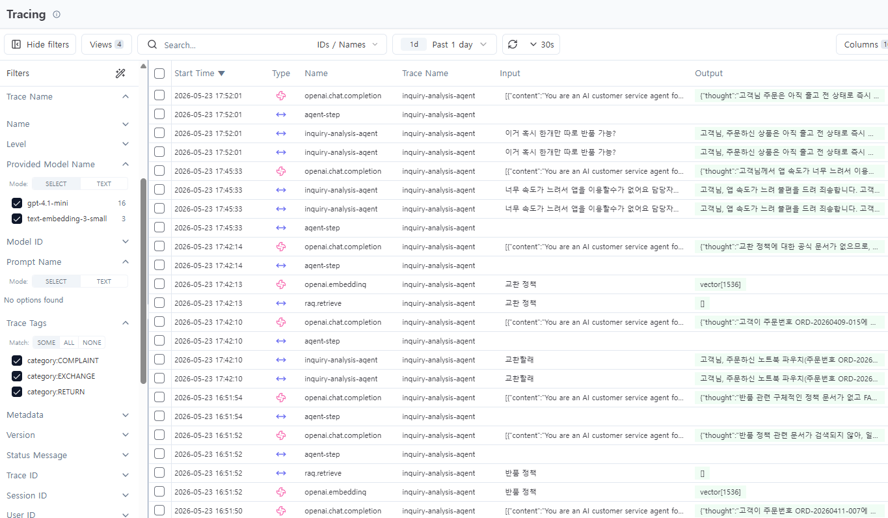
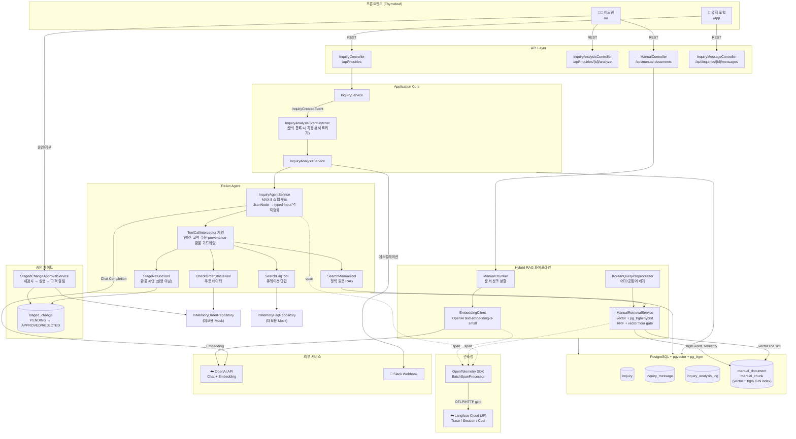
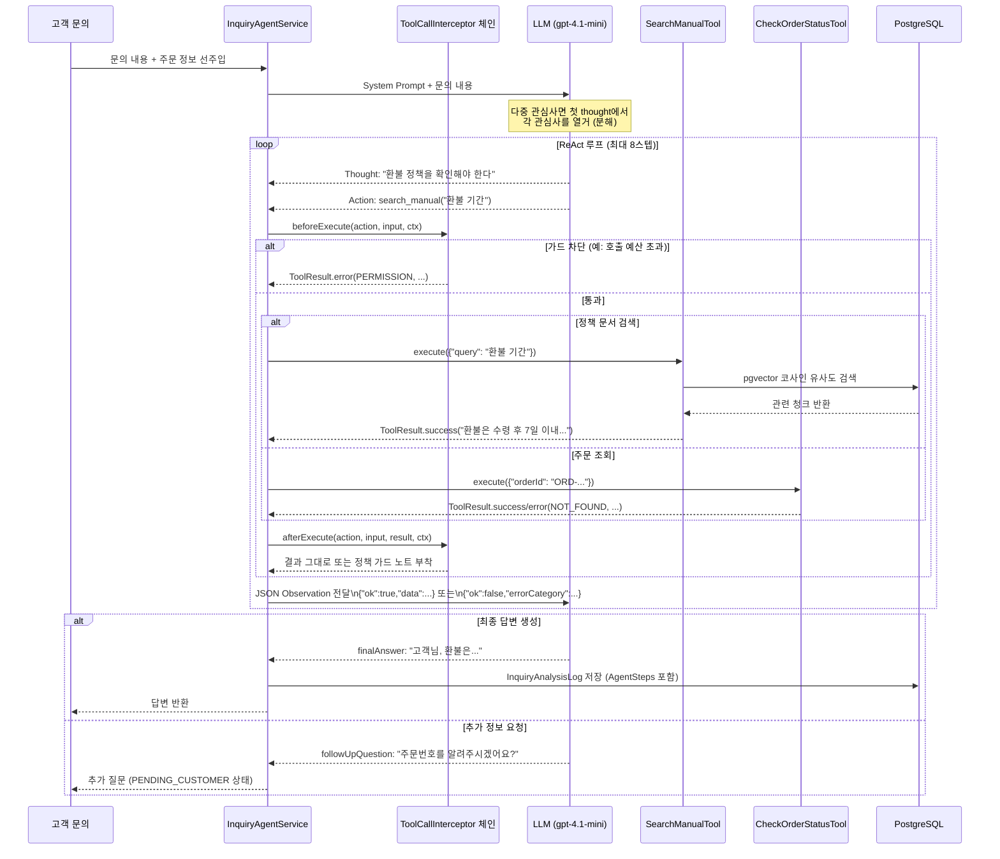
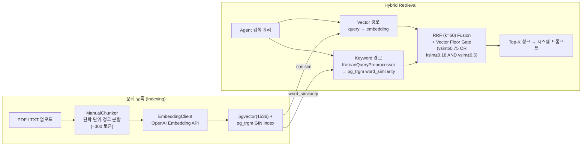
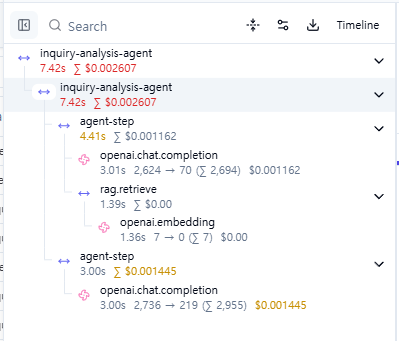
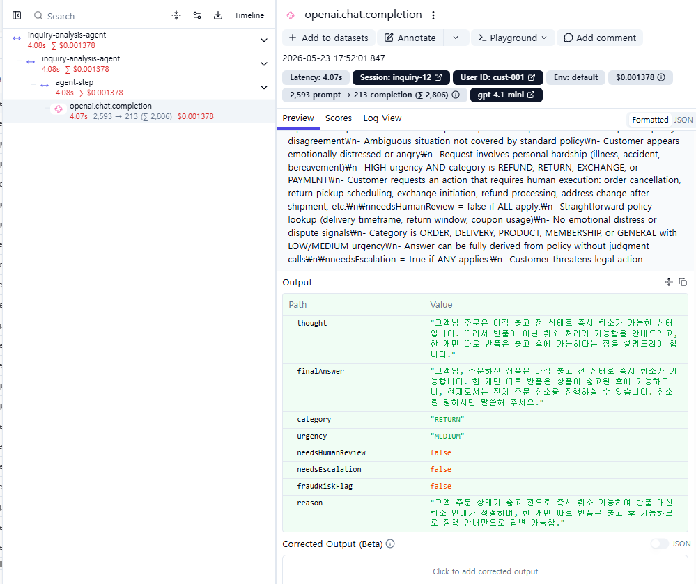
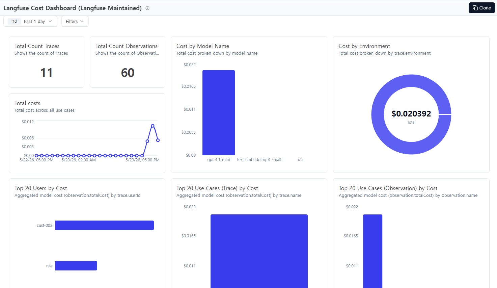
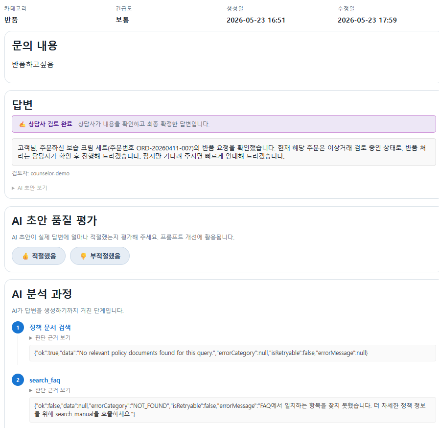
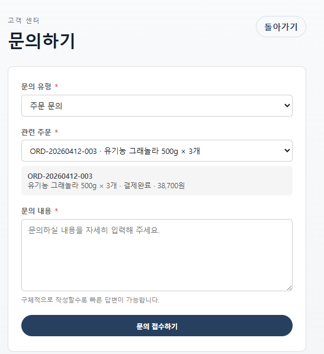
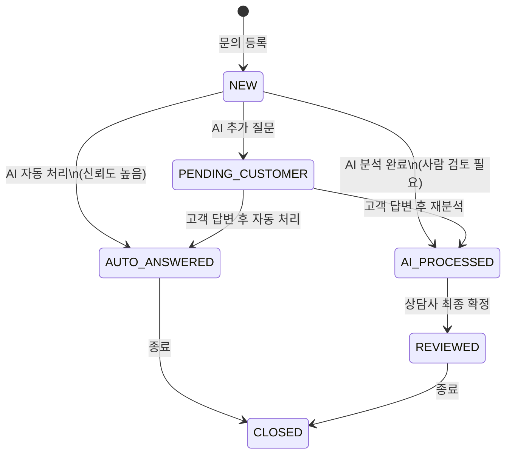

# AI CS Assistant

> AI 기반 고객 문의 자동 분류·답변 시스템 — Spring Boot + ReAct Agent + Hybrid RAG + Langfuse 관측성

🚀 **Live demo**: https://ai-cs-assistant-production.up.railway.app/app
> Railway 무료 플랜(512MB) 기반 데모라 예고 없이 중단될 수 있습니다. 안 열리면 이슈로 알려주세요.
> 데모 계정 3개(김민준 / 이서연 / 박지호) 중 선택 → 문의 등록 → AI agent 분석 → 답변 확인.
> 주문 날짜는 조회 시점 기준으로 계산되므로 언제 보셔도 최근 주문으로 보입니다.

LLM 프레임워크(LangChain 등) 없이 **ReAct Agent 루프**와 **Hybrid RAG 파이프라인**을 직접 설계·구현한 고객 상담 자동화 MVP입니다. 검색 품질은 87 케이스 골든셋으로 회귀 테스트하고, 모든 LLM/Agent/RAG 호출은 OpenTelemetry → Langfuse로 trace를 시각화합니다.



---

## 주요 기능

| 기능 | 설명 |
|---|---|
| **ReAct Agent** | Reasoning + Acting 루프로 툴을 선택·실행하며 다단계 추론 |
| **Hybrid RAG 검색** | Vector(pgvector) + Keyword(pg_trgm) + RRF fusion + Korean preprocessing + vector floor gating |
| **골든셋 회귀 평가** | 87 케이스(positive 72 + negative 15) × Recall@K/MRR/NoMatchAccuracy 메트릭 |
| **Langfuse 관측성** | LLM/Agent/RAG 호출을 OpenTelemetry → OTLP로 trace 시각화 (토큰/비용/latency 자동 집계) |
| **멀티턴 대화** | AI 추가 질문 → 고객 답변 → 재분석 반복 흐름 |
| **자동 라우팅** | 고위험·에스컬레이션 문의는 Slack 알림 + 상담사 검토 큐로 분리 |
| **상담사 어드민** | AI 분석 과정(thought/tool/observation) 시각화 + 최종 답변 확정 |
| **승인 게이트** | AI가 환불을 제안(staging)하고 상담사 승인 후에만 실행 — 가드레일 4종을 코드로 검사 |
| **대시보드** | 자동응답률·평균 응답시간·카테고리 분포 등 KPI 시각화 |
| **유저 포털** | 주문 기반 문의 등록, 멀티턴 대화, 답변 확인 |

## 검색 품질 (87 케이스 골든셋 기준)

Vector 단독 검색 대비 Hybrid 도입 후 baseline 변화:

| 지표 | Vector only | **Hybrid** | 변화 |
|---|---|---|---|
| positive Recall@3 | 0.806 | **0.833** | +2.7pp |
| MRR | 0.806 | **0.833** | +2.7pp |
| hard Recall@3 | 0.000 | **0.143** | **+14.3pp** |
| easy+medium Recall@1 | 1.0 | **1.0** | 유지 |
| NoMatchAccuracy | 1.0 | **1.0** | 유지 |

> hard 케이스가 14% 회복되면서도 negative(검색되면 안 되는) 케이스에서 false positive 0건 유지.

---

## 시스템 아키텍처


```mermaid
flowchart TB
    subgraph UI["프론트엔드 (Thymeleaf)"]
        direction LR
        UserUI["👤 유저 포털\n/app"]
        AdminUI["🧑‍💼 어드민\n/ui"]
    end

    subgraph API["API Layer"]
        InquiryAPI["InquiryController\n/api/inquiries"]
        AnalysisAPI["InquiryAnalysisController\n/api/inquiries/{id}/analyze"]
        ManualAPI["ManualController\n/api/manual-documents"]
        MessageAPI["InquiryMessageController\n/api/inquiries/{id}/messages"]
    end

    subgraph Core["Application Core"]
        InquiryService["InquiryService"]
        EventListener["InquiryAnalysisEventListener\n(문의 등록 시 자동 분석 트리거)"]
        AnalysisService["InquiryAnalysisService"]
    end

    subgraph Agent["ReAct Agent"]
        AgentLoop["InquiryAgentService\nMAX 8 스텝 루프\nJsonNode → typed Input 역직렬화"]
        Interceptors["ToolCallInterceptor 체인\n(예산·고액 주문·provenance·환불 가드레일)"]
        FaqTool["SearchFaqTool\n큐레이션 단답"]
        SearchTool["SearchManualTool\n정책 원문 RAG"]
        OrderTool["CheckOrderStatusTool\n주문 데이터"]
        RefundTool["StageRefundTool\n환불 제안 (실행 아님)"]
    end

    subgraph Staging["승인 게이트"]
        StagedChange[("staged_change\nPENDING → APPROVED/REJECTED")]
        Approval["StagedChangeApprovalService\n재검사 → 실행 → 고객 알림"]
    end

    subgraph RAG["Hybrid RAG 파이프라인"]
        Chunker["ManualChunker\n문서 청크 분할"]
        EmbedClient["EmbeddingClient\nOpenAI text-embedding-3-small"]
        KoreanPrep["KoreanQueryPreprocessor\n어미/공통어 제거"]
        Retrieval["ManualRetrievalService\nvector + pg_trgm hybrid\nRRF + vector floor gate"]
    end

    subgraph DB["PostgreSQL + pgvector + pg_trgm"]
        T1[("inquiry")]
        T2[("inquiry_message")]
        T3[("inquiry_analysis_log")]
        T4[("manual_document\nmanual_chunk\n(vector + trgm GIN index)")]
    end

    subgraph Observe["관측성"]
        OTel["OpenTelemetry SDK\nBatchSpanProcessor"]
        Langfuse["☁️ Langfuse Cloud (JP)\nTrace / Session / Cost"]
    end

    subgraph External["외부 서비스"]
        OpenAI["☁️ OpenAI API\nChat + Embedding"]
        Slack["💬 Slack Webhook"]
    end

    UserUI -->|REST| InquiryAPI & MessageAPI
    AdminUI -->|REST| AnalysisAPI & ManualAPI
    InquiryAPI --> InquiryService
    InquiryService -->|InquiryCreatedEvent| EventListener
    EventListener --> AnalysisService
    AnalysisService --> AgentLoop
    AgentLoop --> Interceptors --> FaqTool & SearchTool & OrderTool & RefundTool
    RefundTool --> StagedChange
    AdminUI -->|승인/거부| Approval
    Approval --> StagedChange
    Approval --> InMemoryOrder
    FaqTool --> InMemoryFaq["InMemoryFaqRepository\n(데모용 Mock)"]
    SearchTool --> Retrieval
    OrderTool --> InMemoryOrder["InMemoryOrderRepository\n(데모용 Mock)"]
    Retrieval -->|vector cos sim| T4
    Retrieval -->|trgm word_similarity| T4
    KoreanPrep --> Retrieval
    AgentLoop -->|Chat Completion| OpenAI
    ManualAPI --> Chunker --> EmbedClient
    EmbedClient -->|Embedding| OpenAI
    AnalysisService -->|에스컬레이션| Slack
    AgentLoop -.->|span| OTel
    Retrieval -.->|span| OTel
    EmbedClient -.->|span| OTel
    OTel -->|OTLP/HTTP gzip| Langfuse
    Core & Agent & RAG --> DB
```

---

## ReAct Agent 동작 원리

LLM이 매 스텝마다 **생각(Thought) → 행동(Action) → 관찰(Observation)** 을 반복하며 최종 답변을 도출합니다.


```mermaid
sequenceDiagram
    participant C as 고객 문의
    participant A as InquiryAgentService
    participant I as ToolCallInterceptor 체인
    participant L as LLM (gpt-4.1-mini)
    participant S as SearchManualTool
    participant O as CheckOrderStatusTool
    participant DB as PostgreSQL

    C->>A: 문의 내용 + 주문 정보 선주입
    A->>L: System Prompt + 문의 내용

    Note over L: 다중 관심사면 첫 thought에서<br/>각 관심사를 열거 (분해)

    loop ReAct 루프 (최대 8스텝)
        L-->>A: Thought: "환불 정책을 확인해야 한다"
        L-->>A: Action: search_manual("환불 기간")

        A->>I: beforeExecute(action, input, ctx)
        alt 가드 차단 (예: 호출 예산 초과)
            I-->>A: ToolResult.error(PERMISSION, ...)
        else 통과
            alt 정책 문서 검색
                A->>S: execute({"query": "환불 기간"})
                S->>DB: pgvector 코사인 유사도 검색
                DB-->>S: 관련 청크 반환
                S-->>A: ToolResult.success("환불은 수령 후 7일 이내...")
            else 주문 조회
                A->>O: execute({"orderId": "ORD-..."})
                O-->>A: ToolResult.success/error(NOT_FOUND, ...)
            end
            A->>I: afterExecute(action, input, result, ctx)
            I-->>A: 결과 그대로 또는 정책 가드 노트 부착
        end

        A->>L: JSON Observation 전달\n{"ok":true,"data":...} 또는\n{"ok":false,"errorCategory":...}
    end

    alt 최종 답변 생성
        L-->>A: finalAnswer: "고객님, 환불은..."
        A->>DB: InquiryAnalysisLog 저장 (AgentSteps 포함)
        A-->>C: 답변 반환
    else 추가 정보 요청
        L-->>A: followUpQuestion: "주문번호를 알려주시겠어요?"
        A-->>C: 추가 질문 (PENDING_CUSTOMER 상태)
    end
```

---

## Hybrid RAG 파이프라인

벡터 단독 검색은 paraphrase에 강하지만 **정확한 토큰 매칭(영어 혼용, 오타, 한국어 어미 변형)에 약합니다.** 두 검색의 약점이 정확히 반대라 RRF로 결합하면 둘 다 보완됩니다.


```mermaid
flowchart LR
    subgraph Indexing["문서 등록 (Indexing)"]
        direction TB
        Upload["PDF / TXT 업로드"]
        Chunk["ManualChunker\n단락 단위 청크 분할\n(≈300 토큰)"]
        Embed["EmbeddingClient\nOpenAI Embedding API"]
        Store["pgvector(1536) +\npg_trgm GIN index"]
        Upload --> Chunk --> Embed --> Store
    end

    subgraph Retrieval["Hybrid Retrieval"]
        direction TB
        Query["Agent 검색 쿼리"]
        VPath["Vector 경로\nquery → embedding"]
        KPath["Keyword 경로\nKoreanQueryPreprocessor\n→ pg_trgm word_similarity"]
        Fuse["RRF (k=60) Fusion\n+ Vector Floor Gate\n(vsim≥0.75 OR<br/>ksim≥0.18 AND vsim≥0.5)"]
        Inject["Top-K 청크 → 시스템 프롬프트"]
        Query --> VPath & KPath
        VPath --> Fuse
        KPath --> Fuse
        Fuse --> Inject
    end

    Store -->|cos sim| VPath
    Store -->|word_similarity| KPath
```

### 핵심 설계 결정 (`ManualRetrievalService`)
- **Vector floor gating**: `vector ≥ 0.75 OR (keyword ≥ 0.18 AND vector ≥ 0.5)` — keyword 노이즈로 인한 false positive 차단
- **RRF (k=60)**: rank만 사용 → 점수 정규화 불필요 (Microsoft 연구 권장값)
- **Korean preprocessing**: `"수 있나요"`, `"어떻게"` 같은 한국어 어미를 keyword 검색 전에 제거 — pg_trgm이 한국어 형태소를 모르기 때문에 어미가 모든 문서와 trigram이 겹쳐 false-positive 점수를 부풀리는 문제 해결
- **Index-friendly SQL**: `WHERE ? <% content` operator + `<<->` distance로 `gin_trgm_ops` 인덱스 활용 (함수 비교는 인덱스를 못 탐)
- **Augmented gate**: keyword-only 후보가 vector top-K 밖에 있어도 별도 쿼리로 vector score를 보강해 gate 통과 가능 (대규모 데이터 정합성)

---

## 골든셋 회귀 평가

검색 로직을 개선해도 효과를 측정할 수단이 없으면 회귀가 노이즈인지 실효인지 분간이 어렵습니다. 87 케이스 골든셋으로 코드 변경마다 메트릭이 자동 검증되도록 했습니다.

### 데이터셋 (`src/test/resources/eval/rag-golden-set.csv`)

| 분류 | Easy | Medium | Hard | 합 |
|---|---|---|---|---|
| Positive (REFUND/DELIVERY/EXCHANGE/RETURN/MEMBERSHIP/PAYMENT) | 28 | 30 | 14 | 72 |
| Negative (날씨/주식/매장위치/사업자등록 등) | 5 | 5 | 5 | 15 |

다양성 축: paraphrase, 영어 혼용(`"refund 가능한가요"`), 오타(`"배달 너무 늦엇어요"`), 매우 짧음(`"반품"`), 구어체.

### 메트릭 (`RagRetrievalMetrics`)

| 지표 | 의미 |
|---|---|
| **Recall@K** | 정답 문서가 top K 안에 들어왔는가 (놓치지 않는 능력) |
| **MRR** | 정답이 평균 몇 위인가 (위치 가중) |
| **NoMatchAccuracy** | negative 케이스에서 빈 결과 반환 비율 (헛검색 방지) |

### Hybrid 도입 전후 비교

| 지표 | Vector only | Hybrid | 변화 |
|---|---|---|---|
| positive Recall@3 | 0.806 | **0.833** | +2.7pp |
| MRR | 0.806 | **0.833** | +2.7pp |
| hard Recall@3 | 0.000 | **0.143** | **+14.3pp** |
| easy+medium Recall@1 | 1.0 | 1.0 | 유지 |
| NoMatchAccuracy | 1.0 | **1.0** | 유지 |

회귀 안전망: 매뉴얼 6개 + distractor 25개로 **vector top-K 밖에 있는 keyword-strong 케이스**가 회복되는지도 별도 테스트로 검증.

---

## 관측성 — Langfuse + OpenTelemetry

LLM 시스템 운영의 가장 큰 문제는 **"뭐가 어떻게 흘러가는지 안 보이는 것"** 입니다. DB에 토큰/latency를 적재하긴 했지만 분석 시마다 SQL을 짜야 했습니다. Langfuse 공식 가이드에 따라 **Java 전용 SDK 대신 OpenTelemetry 표준**으로 OTLP endpoint에 export하도록 구성 (벤더 lock-in 없음).

### Trace 트리

문의 1건이 만드는 span 계층:



```
inquiry-analysis-agent (SPAN, root)
  └─ agent-step (SPAN, index=0..N)
     ├─ openai.chat.completion (GENERATION, tokens/cost 자동 집계)
     ├─ openai.embedding (GENERATION)
     └─ rag.retrieve (SPAN, retrieval.path 표시)
```

| Trace 위치 | Type | 자동 집계 |
|---|---|---|
| `inquiry-analysis-agent` (root) | SPAN | `langfuse.session.id`/`user.id`/`trace.tags` |
| `agent-step` | SPAN | `agent.step.index`, `agent.tool` |
| `openai.chat.completion` | **GENERATION** | model, prompt/completion tokens, cost |
| `openai.embedding` | **GENERATION** | model, total tokens, cost |
| `rag.retrieve` | SPAN | `retrieval.path` (hybrid/fallback), `result_count` |

### LLM 호출 상세

GENERATION span을 클릭하면 prompt/response/token/비용/모델이 모두 펼쳐집니다. LLM 응답이 정의된 JSON 스키마(`thought`/`finalAnswer`/`category`/`urgency`/`needsHumanReview`/...)로 강제돼 Langfuse가 자동으로 path/value 트리 시각화:



### 비용/사용량 대시보드

`langfuse.user.id`로 그룹핑된 사용자별 비용, 모델별 비용, 시간대별 trace 수가 자동 집계됩니다.



### 운영 안전 장치
- 키 없으면 `OpenTelemetry.noop()` fallback → 본 동작 무영향
- `@Bean(destroyMethod = "close")` 로 Spring 종료 시 BatchSpanProcessor flush 보장
- `SpanLimits.maxAttributeValueLength = 8192` 자동 truncate (PII/payload bloat 방지)
- gzip compression + tuned BatchSpanProcessor (queue 2048, schedule 2s, timeout 5s)

---

## 어드민 분석 시각화

상담사 어드민에서 AI가 생성한 답변과 **분석 단계별 thought/action/observation**을 그대로 시각화합니다. 도구 응답은 `ToolResult` 구조로 직렬화되어 `errorCategory`/`isRetryable`까지 확인 가능:



---

## 유저 포털 — Agent 정확도 향상 UX

문의 등록 시 카테고리에 따라 주문 드롭다운을 노출해 **고객이 주문번호를 직접 입력하는 실수**를 없앱니다. Agent 루프 시작 전 정확한 주문 정보가 선주입되어 `followUpQuestion` 발생률이 크게 감소합니다.



---

## 문의 상태 머신


```mermaid
stateDiagram-v2
    [*] --> NEW : 문의 등록

    NEW --> AI_PROCESSED : AI 분석 완료\n(사람 검토 필요)
    NEW --> AUTO_ANSWERED : AI 자동 처리\n(신뢰도 높음)
    NEW --> PENDING_CUSTOMER : AI 추가 질문

    PENDING_CUSTOMER --> AI_PROCESSED : 고객 답변 후 재분석
    PENDING_CUSTOMER --> AUTO_ANSWERED : 고객 답변 후 자동 처리

    AI_PROCESSED --> REVIEWED : 상담사 최종 확정

    AUTO_ANSWERED --> CLOSED : 종료
    REVIEWED --> CLOSED : 종료
```

---

## 기술 스택

| 분류 | 기술 |
|---|---|
| **Language / Runtime** | Java 17, Spring Boot 3.5 |
| **AI** | OpenAI gpt-4.1-mini (Chat), text-embedding-3-small (Embedding) |
| **Hybrid Search** | PostgreSQL + pgvector (vector) + pg_trgm (keyword) + RRF fusion |
| **관측성** | OpenTelemetry SDK 1.46 → Langfuse Cloud (OTLP/HTTP gzip) |
| **ORM** | Spring Data JPA + Hibernate |
| **Web / UI** | Spring MVC, Thymeleaf |
| **문서 처리** | Apache PDFBox |
| **코드 품질** | Lombok |
| **테스트** | JUnit 5, Testcontainers (pgvector image), Spring MockMvc, AssertJ |
| **알림** | Slack Incoming Webhook |
| **API 문서** | springdoc-openapi (Swagger UI) |

---

## 핵심 설계 결정

### 1. ReAct Agent 직접 구현
LangChain, Spring AI 등 프레임워크 없이 `InquiryAgentService`에서 루프를 직접 제어합니다. 중간 과정(Thought/Action/Observation)을 `AgentStep` 객체로 수집해 DB에 저장하고, 어드민 UI에서 실시간 시각화합니다.

### 2. 이벤트 기반 분석 트리거
문의 등록 시 `InquiryCreatedEvent`를 발행해 `InquiryAnalysisEventListener`가 비동기로 AI 분석을 트리거합니다. API 응답과 AI 처리를 분리해 등록 응답 속도를 보장합니다.

### 3. 도메인 상태 캡슐화
`Inquiry` 엔티티가 `markAiProcessed()`, `askFollowUp()`, `confirmReview()` 등 상태 전이 메서드를 직접 소유합니다. 외부에서 setter로 상태를 임의 변경할 수 없습니다.

### 4. 주문 정보 선주입 (Context Pre-injection)
문의에 `relatedOrderId`가 있으면 Agent 루프 시작 전 주문 정보를 시스템 메시지에 선주입합니다. 루프 내 툴 호출 횟수를 줄이고 `followUpQuestion` 발생률을 낮춥니다.

### 5. AI 초안과 최종 답변 분리
`AI_PROCESSED` 상태의 AI 초안(`aiDraftAnswer`)은 어드민에게만 표시합니다. 유저는 상담사가 확정한 `finalAnswer`(`REVIEWED`)나 AI 자동 처리(`AUTO_ANSWERED`) 결과만 볼 수 있습니다.

### 6. 멀티턴 추가 질문 최대 3회 제한 및 에스컬레이션
Agent는 필요한 정보(주문번호 등)가 없을 때 `followUpQuestion`으로 고객에게 되물을 수 있습니다. 단, 동일 대화에서 최대 3회까지만 허용하며, 3회 이후에도 유효한 정보를 얻지 못하면 `needsHumanReview: true`로 상담사에게 에스컬레이션합니다. "기억 안나요"처럼 모호한 답변은 정보 제공으로 인정하지 않고 추가 질문을 이어갑니다. 무한 루프 방지와 고객 경험 사이의 균형을 프롬프트 레벨에서 제어합니다.

### 7. UI 선입력으로 Agent 정확도 향상
Agent가 `followUpQuestion`으로 주문번호를 되묻는 대신, 문의 등록 시 카테고리에 따라 주문 선택을 유도합니다. 배송·반품·교환·환불·결제 카테고리 선택 시 주문 목록을 드롭다운으로 제공해 고객이 주문번호를 직접 입력하는 실수를 없애고, Agent 루프 시작 전 정확한 주문 정보를 선주입합니다. **"AI가 얼마나 잘 추론하느냐"도 중요하지만, 입력 품질을 UI 단에서 보장하는 것이 더 근본적인 정확도 향상 방법**임을 설계 과정에서 확인했습니다.

### 8. 에스컬레이션 기반 액션 처리
취소·반품·교환 등 **실제 처리 액션이 필요한 문의**는 AI가 직접 처리하지 않고 `needsHumanReview: true`로 에스컬레이션합니다. 시스템 프롬프트에서 "고객센터에 연락하세요"류 표현을 명시적으로 금지하며, 대신 "담당자가 확인 후 처리해 드리겠습니다"로 안내하고 상담사 검토 큐로 라우팅합니다. 상담사가 실제 처리 후 `finalAnswer`를 작성하면 고객에게 전달됩니다.

### 9. 구조화된 도구 응답 (ToolResult)
도구 실행 결과를 단순 문자열이 아닌 `ToolResult` 레코드로 반환합니다. 실패 시 `ToolErrorCategory`(`TRANSIENT` / `VALIDATION` / `PERMISSION` / `NOT_FOUND`)와 `isRetryable`을 함께 LLM에 JSON으로 전달해, 에이전트가 에러 유형에 맞는 다음 행동(재시도 / 입력 수정 / 에스컬레이션 / 추가 질문)을 선택할 수 있게 합니다. 도구 내부 예외는 `TRANSIENT`로 래핑되어 같은 채널로 전달됩니다.

### 10. 코드 레벨 가드레일 — ToolCallInterceptor
프롬프트 의존만으로는 LLM이 정책을 우회할 위험이 있어, 도구 호출 직전/직후에 끼어드는 `ToolCallInterceptor` 체인을 두었습니다.
- **`ToolCallBudgetInterceptor`** — 한 분석 세션에서 6회 초과 호출을 `PERMISSION` 에러로 차단해 finalAnswer 생성을 강제
- **`HighValueOrderInterceptor`** — `check_order_status` 결과의 결제금액이 100만원 이상이면 정책 가드 노트를 부착해 자동 처리 대신 상담사 라우팅을 강제

새 가드는 `ToolCallInterceptor` 구현체를 Spring 빈으로 추가하면 자동으로 체인에 등록됩니다.

### 11. 타입 세이프 도구 인터페이스 + 7-필드 표면 (Tool Interface Design)
모델은 도구의 소스코드가 아니라 표면(surface)만 보고 호출을 결정합니다(공식 가이드 *CCAF Domain 2 — Tool Interface Design*의 좋은 도구 설명 4요소: 입력 형식 · 예제 질의 · 엣지 케이스 · 유사 도구 경계). 이를 모두 노출하기 위해 `AgentTool<I>`는 7개 표면 메서드를 갖습니다.

```java
public interface AgentTool<I> {
    String name();
    String description();        // 무엇을 하는지
    String whenToUse();          // 언제 호출해야 하는지
    String usageBoundary();      // 쓰지 말아야 할 때 / 유사 도구와의 경계 (가이드 4번)
    Class<I> inputType();        // 역직렬화 타깃 record
    String inputSchema();        // 입력 필드 형태/제약 (가이드 1번)
    String successOutputHint();  // 성공 시 data 필드 형태
    String failureBehavior();    // 카테고리별 LLM 대응 가이드 (가이드 3번)
    ToolResult execute(I input);
}
```

각 도구는 자기 입력을 nested record로 선언하고(`SearchManualTool.Input`, `CheckOrderStatusTool.Input`, `SearchFaqTool.Input`), `InquiryAgentService`가 `ObjectMapper.treeToValue`로 JsonNode → record를 자동 변환합니다. 변환 실패는 `ToolResult.error(VALIDATION, ...)`로 LLM에 반환되어 입력 수정/추가 질문 흐름이 자동 트리거됩니다. `PromptFactory`는 도구별 7개 표면을 통일된 블록으로 시스템 프롬프트에 노출해 모델이 첫 호출 전에 모든 정보를 갖게 합니다. 특히 `usageBoundary`는 **유사 기능 도구가 늘어났을 때 모델의 도구 선택 정확도를 좌우하는 핵심 신호**입니다.

### 12. 유사 기능 도구 차별화 (search_faq vs search_manual)
가이드 1단계의 "유사 기능 도구를 두어 description 차별화 압력을 만든다" 연습. 두 도구가 모두 정책 정보 텍스트를 반환하지만 의도가 다릅니다.

| 도구 | 무엇을 반환 | 언제 호출 | 비용/응답 길이 |
|---|---|---|---|
| `search_faq` | 큐레이션된 짧은 Q&A 1개 | 자주 묻는 단순 질문 (환불 며칠 / 회원 탈퇴 등) | 저비용·즉답 |
| `search_manual` | 정책 원문 청크 N개 (RAG) | 정확한 조항/예외/세부 절차 | 고비용·길이 김 |
| `check_order_status` | 특정 주문 데이터 | 고객이 주문 ID 명시 | mock 조회 |

세 도구의 `usageBoundary`는 서로를 명시적으로 가리키며 (`search_faq` NOT_FOUND → `search_manual` 폴백, 등), `PromptFactory.Guidelines`에 한 줄짜리 도구 선택 규칙을 함께 노출합니다. 모델이 description의 자기설명만으로 단순 FAQ는 `search_faq`로 즉답하고, 매칭 실패 시 자동으로 `search_manual`로 폴백하는 흐름을 통합 테스트로 보호합니다.

### 13. 다중 관심사 메시지 분해/통합 처리
한 메시지에 여러 요청이 섞여 있을 때(예: *"ORD-XXX 배송 언제 와요? 그리고 반품 정책 알려주세요"*) Agent가 각 관심사를 첫 `thought`에서 열거하고, 필요한 도구를 모두 호출한 뒤, 관심사별 헤더(`1)`, `2)`)가 붙은 **하나의 통합된 finalAnswer**를 생성합니다. 자동 처리 가능한 부분과 상담사 액션이 필요한 부분이 섞여 있으면 답할 수 있는 부분은 즉시 답하고 나머지는 `needsHumanReview: true`로 라우팅합니다. 가드(예산 초과, 정책 가드)가 중간에 발동해 일부만 처리된 경우에도 누락 없이 "처리 완료 / 상담사 인계" 구분을 명시합니다.

### 14. Hybrid 검색 도입 (Vector + Keyword + RRF)
벡터 단독 검색은 paraphrase에 강하지만 정확한 토큰 매칭(영어 혼용/오타/한국어 어미 변형)에 약합니다. 골든셋 분석에서 hard 케이스 14개가 모두 vector threshold에 컷되는 것을 확인하고 `pg_trgm` 기반 keyword 검색을 추가했습니다.

- **Fusion 방식**: RRF (Reciprocal Rank Fusion, k=60) — rank만 사용해 점수 정규화 불필요
- **Gate 정책**: `vector ≥ 0.75 OR (keyword ≥ 0.18 AND vector ≥ 0.5)` — keyword 노이즈로 인한 false positive 차단
- **Korean preprocessing**: pg_trgm은 한국어 형태소를 모르기 때문에 "수 있나요", "어떻게" 같은 공통 어미가 모든 문서와 trigram이 겹쳐 false-positive 점수를 부풀리는 현상 발생. `KoreanQueryPreprocessor`에서 어미/공통어를 사전 제거.
- **Index 활용**: `WHERE ? <% content` operator + `<<-> distance` 로 `gin_trgm_ops` GIN 인덱스 사용 (함수 호출 비교 형태는 인덱스를 못 탐)
- **Augmented gate**: 운영 규모에서 keyword-only 후보가 vector top-K 밖에 있을 수 있어, union된 id에 대해 vector score를 보강한 뒤 gate를 적용
- **효과**: hard Recall@3 `0.0 → 0.143`, positive Recall@3 `0.806 → 0.833`, NoMatchAccuracy `1.0` 유지

### 15. 골든셋 회귀 평가
"RAG 구현했습니다"보다 **"검색 품질을 데이터로 관리합니다"** 가 훨씬 강한 신호라고 판단해 87 케이스 골든셋(positive 72 + negative 15)과 4개 메트릭(Recall@K, MRR, NoMatchAccuracy, 카테고리/난이도별 분리)을 구축했습니다.

- 케이스 다양성: easy/medium/hard 분포 + paraphrase / 영어 혼용 / 오타 / 매우 짧음 / 구어체
- Negative 케이스 3단계: 완전 무관(날씨/점심) / 인접 도메인(매장 영업시간) / 정책 도메인 인접(사업자등록/세금)
- `FakeEmbeddingClient`를 difficulty 기반으로 설계 (easy=1.0 / medium=0.91 / hard=0.65) — 검색 로직 개선이 메트릭 차이로 드러나도록
- distractor 25개 회귀 테스트로 hybrid의 vector floor gate가 대규모 데이터에서도 동작함을 검증

### 16. Langfuse 관측성 (OpenTelemetry 표준)
Langfuse Java SDK가 없어 OpenTelemetry SDK + OTLP endpoint로 통합 → 벤더 lock-in 없이 trace 시각화.

- 표준 GenAI semantic convention (`gen_ai.system`, `gen_ai.request.model`, prompt/completion tokens) 양쪽(구/신 OTel semconv) 모두 설정해 비용 계산 호환성 확보
- LLM 호출만 `langfuse.observation.type = "generation"`으로 마킹 → Langfuse가 LLM 전용 UI(model/tokens/cost) 자동 활성화
- `langfuse.session.id = "inquiry-{id}"`, `langfuse.user.id`, `langfuse.trace.tags = [category:X, urgency:Y]` 로 Sessions/Users/Tags 1급 필터 활용
- 운영 안전 장치: noop fallback, `destroyMethod = "close"` 로 종료 시 flush, `SpanLimits.maxAttributeValueLength = 8192`, gzip + tuned BatchSpanProcessor

### 17. 분리 가능한 모놀리스 (Separable Monolith)
현재는 단일 Spring Boot 앱이지만 **`analysis` 패키지를 독립 서비스로 추출 가능한 구조**입니다.

- 패키지 의존성 단방향: `analysis` → 다른 도메인 (역방향 없음)
- 이벤트 드리븐: `InquiryAnalysisEventListener`가 이미 비동기로 격리 → 외부 호출(REST/큐)로 바꾸기만 하면 분리됨
- 외부 의존성 격리: OpenAI 클라이언트, 임베딩 클라이언트는 `analysis.infra.llm` 안에만 존재

**분리 트리거 (언제 분리할 것인가)**:
- AI 처리 평균 latency가 일반 API의 p99에 영향을 주기 시작
- LLM 스택을 Python 생태계(LangChain, vLLM 등)로 옮기는 게 비즈니스 가치 있음
- GPU 같은 다른 리소스 프로파일이 필요

그 전까지는 모놀리스가 운영 비용이 작아 유리하다고 판단.

---

## 로컬 실행

### 사전 요구사항
- JDK 17+
- Docker (PostgreSQL + pgvector + pg_trgm 컨테이너)

### DB 띄우기 (docker-compose)

```bash
docker compose up -d
```

`pgvector/pgvector:pg16` 이미지를 사용합니다. `schema.sql`이 부팅 시 자동 실행되어 `vector`, `pg_trgm` 확장과 trigram GIN 인덱스가 함께 생성됩니다.

### 환경변수 (`.env.local`)

```bash
# 필수
OPENAI_API_KEY=sk-...                              # OpenAI API Key

# 선택 — Langfuse 관측성 (없으면 trace export 비활성화)
LANGFUSE_PUBLIC_KEY=pk-lf-...
LANGFUSE_SECRET_KEY=sk-lf-...
LANGFUSE_BASE_URL=https://jp.cloud.langfuse.com    # JP/US/EU 중 본인 region

# 선택 — Slack 에스컬레이션 알림
SLACK_WEBHOOK_URL=https://hooks.slack.com/...
```

IntelliJ 사용 시 EnvFile 플러그인 + Run Configuration에서 `.env.local` 활성화 (Active profiles: `local`).

### 실행

```bash
./gradlew bootRun --args='--spring.profiles.active=local'
```

### 접속

| 화면 | 로컬 | Live (2026-08-23까지) |
|---|---|---|
| 유저 포털 | http://localhost:8080/app | [열기](https://ai-cs-assistant-production.up.railway.app/app) |
| 어드민 | http://localhost:8080/ui/inquiries | [열기](https://ai-cs-assistant-production.up.railway.app/ui/inquiries) |
| 대시보드 | http://localhost:8080/ui/dashboard | [열기](https://ai-cs-assistant-production.up.railway.app/ui/dashboard) |
| 매뉴얼 관리 | http://localhost:8080/ui/manuals | [열기](https://ai-cs-assistant-production.up.railway.app/ui/manuals) |
| Swagger UI | http://localhost:8080/swagger-ui.html | [열기](https://ai-cs-assistant-production.up.railway.app/swagger-ui.html) |

---

## 데모 시나리오

앱 최초 실행 시 정책 문서 10종을 자동으로 시딩합니다. 문의는 유저 포털에서 직접 등록합니다.

### 추천 테스트 흐름

**1. 주문 관련 자동 처리**
- 유저 포털 → 김민준 로그인 → 문의하기
- 유형: 배송 문의 / 주문: `ORD-20260410-001` 선택
- 내용: "배송이 언제 오나요?"
- → Agent가 `check_order_status` 툴로 주문 조회 후 자동 답변

**2. 정책 문서 RAG**
- 유형: 반품 문의 / 내용: "단순 변심으로 반품하고 싶은데 가능한가요?"
- → `search_manual` 툴로 반품 정책 청크 검색 후 답변 생성

**3. 에스컬레이션 (Slack 알림)**
- 유형: 불만/건의 / 내용: "상담원이 너무 불친절했습니다"
- → AI가 `needsEscalation: true` 판단 → Slack 알림 + 어드민 검토 큐

**4. 메뉴얼 추가 전후 비교**
- `/ui/manuals` → 직접 입력으로 새 정책 등록
- 동일한 문의를 등록 전/후로 비교해 RAG 반영 여부 확인

**5. 다중 관심사 메시지**
- 유형: 배송 문의 / 주문: `ORD-20260410-001` 선택
- 내용: "배송 언제 와요? 그리고 반품 가능 기간도 알려주세요"
- → Agent가 `check_order_status` + `search_manual` 두 도구를 모두 호출 → `1) 배송: ... 2) 반품: ...` 형태로 통합 답변

---

## 프로젝트 구조

```
src/main/java/com/aicsassistant/
├── inquiry/                # 문의 도메인 (Inquiry, InquiryMessage, 상태 머신)
│   ├── domain/
│   ├── application/        # InquiryService, ReviewService
│   ├── api/                # REST Controller
│   ├── dto/
│   └── infra/
├── analysis/               # AI 분석 도메인
│   ├── agent/              # ReAct Agent 루프, AgentTool, ToolResult, ToolCallInterceptor
│   │   ├── interceptor/    # ToolCallBudgetInterceptor, HighValueOrderInterceptor, OrderProvenanceInterceptor, RefundGuardrailInterceptor
│   │   └── tool/           # SearchFaqTool, SearchManualTool, CheckOrderStatusTool, StageRefundTool
│   ├── application/        # InquiryAnalysisService, AnalysisLogService
│   ├── api/
│   ├── domain/             # InquiryAnalysisLog
│   ├── dto/
│   └── infra/              # LlmClient, EmbeddingClient, SlackNotificationService
├── manual/                 # 정책 문서 도메인 (청크 분할, 임베딩, 검색)
│   ├── domain/
│   ├── application/        # ManualService, ManualChunker
│   ├── api/
│   └── infra/              # ManualChunkJdbcRepository (pgvector)
├── staging/                # 환불 승인 게이트 도메인
│   ├── domain/             # StagedChange, StagedChangeStatus, ChangeType, RefundGuardrails
│   ├── application/        # StagedChangeApprovalService
│   ├── api/                # StagedChangeController
│   ├── dto/
│   └── infra/              # StagedChangeRepository
├── faq/                    # 자주 묻는 질문 (InMemoryFaqRepository — 데모 Mock)
├── order/                  # 주문 조회 (InMemoryOrderRepository — 데모 Mock)
├── user/                   # 더미 유저 스토어 (데모용)
├── ui/                     # Thymeleaf 뷰 컨트롤러
│   ├── application/        # DashboardService (집계 쿼리)
│   ├── controller/
│   └── viewmodel/          # ViewModel, DTO (뷰 전달용)
└── common/                 # 공통 설정, 예외, 부트스트랩 시딩
```
